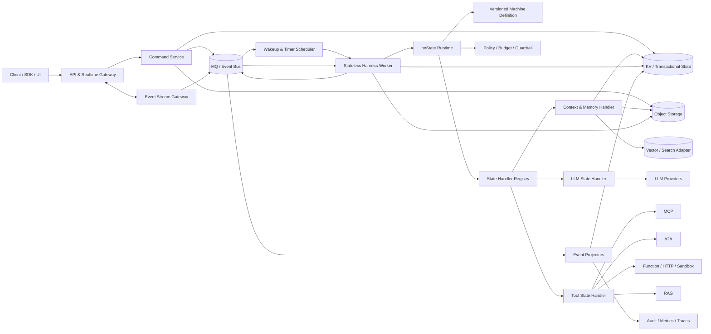
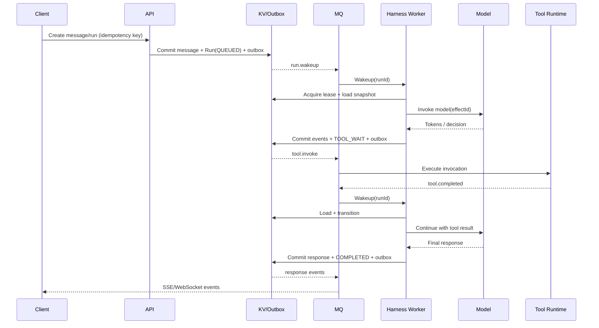
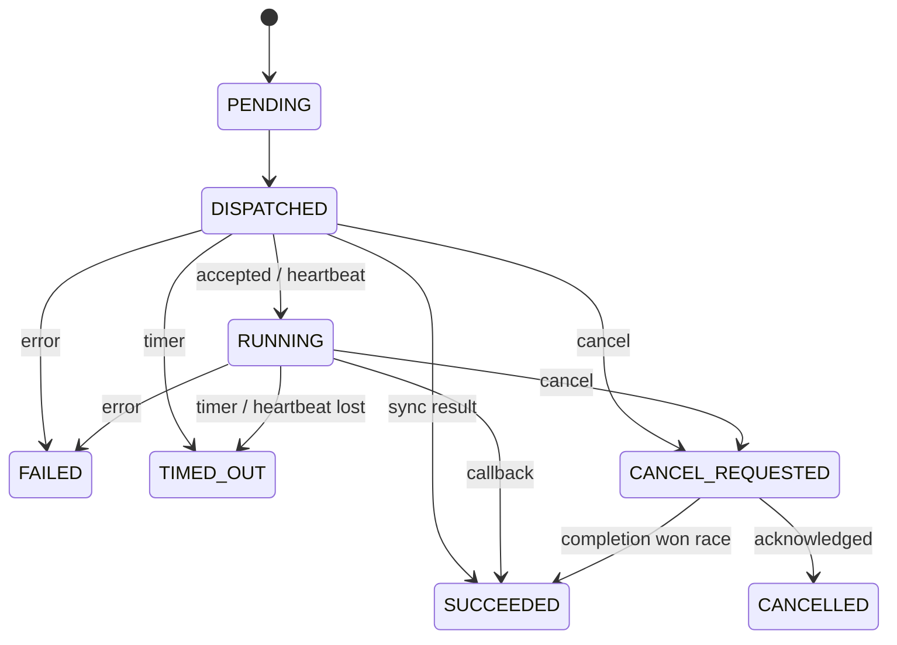

# ElasticHarness 平台总体架构

> 状态：初稿  
> 目标：定义一个以状态机为核心、计算无状态、状态外置、基础设施可插拔的 Harness 平台。

## 1. 愿景与范围

本平台用于承载长时间运行、可暂停、可恢复、可审计的 Agent/Harness Chat。系统把传统进程内的 Agent Loop 转换为持久化状态机：每次计算只处理一个有界步骤，随后提交状态与事件并释放计算资源；下一步由事件、定时器、工具回调或用户输入再次唤醒。

平台的核心输入包括：

- 用户输入：文本、图片、音频、文件及其引用。
- 会话历史：历史消息、历史事件、状态快照和摘要。
- 记忆：会话内工作记忆与跨会话长期记忆。
- 上下文：系统指令、租户策略、模型配置和可用工具清单。

平台的核心输出包括：

- Event 流：模型增量、状态变更、工具调用、审批、错误和生命周期事件。
- 产物：代码、文档、图片、结构化文件以及其他大对象。
- 记忆变更：摘要、事实、偏好、经验以及相应的来源和置信度。

首要目标：

1. **按需计算**：空闲 Chat 不占用常驻 Harness 进程。
2. **可恢复执行**：进程退出、函数超时或节点故障后可从持久状态继续。
3. **基础设施可替换**：领域层不依赖具体 MQ、KV、对象存储、模型或工具协议。
4. **全链路可审计**：输入、决策、外部副作用、状态迁移和产物均可追踪。
5. **多租户隔离**：资源、数据、权限、配额和密钥在租户边界内隔离。

非目标：

- 不把模型推理本身实现为平台能力；模型通过 Provider Adapter 接入。
- 不要求所有工具都同步完成；长任务、人工审批和外部 Agent 均是一等异步能力。
- 不以 MQ 的即时消息保留期替代长期审计存储。

## 2. 架构原则

- **状态外置**：Harness Worker 不保存跨调用的权威状态。
- **定义即数据**：状态、迁移、超时、重试和处理器绑定由版本化定义描述，而不是硬编码在 Worker 中。
- **单步执行**：一次唤醒只推进有限个状态迁移，并受时间、Token、费用和步骤预算约束。
- **事件驱动**：新输入、工具结果、定时器和恢复请求统一转换为领域事件。
- **至少一次交付、效果恰好一次**：基础设施允许重复投递；通过幂等键、租约和 fencing token 保证领域效果不重复。
- **状态机决定控制流**：模型可提出动作，但不能直接改变运行状态或绕过策略。
- **端口与适配器**：领域层定义能力端口，基础设施层实现适配器。
- **组件不等于微服务**：领域和能力先组件化，再独立决定进程边界与部署拓扑。
- **大对象引用化**：媒体、工具大输出和产物进入对象存储，事件中只保存不可变引用与摘要。
- **先写事实，再发通知**：状态与 Outbox 在同一原子边界提交，异步发布事件。
- **默认可观测、可取消、可重放**：每一步都有因果链、资源计量和明确的取消语义。

## 3. 总体视图



整体分为四个平面：

- **接入平面**：命令、查询、上传和实时事件订阅。
- **控制平面**：Chat/Run 生命周期、状态机、调度、租约、策略和配额。
- **执行平面**：无状态 Worker、模型调用、工具执行、记忆检索与生成。
- **数据平面**：KV、MQ、对象存储，以及可选的向量/全文索引。

## 4. DDD 领域划分

### 4.1 Conversation 上下文

负责用户可见的会话语义。

- 聚合：`Chat`
- 实体：`Message`、`ContentPart`
- 值对象：`ChatId`、`MessageId`、`Participant`、`MediaRef`
- 职责：接收用户输入、维护消息顺序、关联 Run、生成会话视图。

`Chat` 是交互容器，不直接承担执行锁和状态机版本控制。一个 Chat 可包含多个顺序或并行 Run，具体并发策略由租户策略决定。

### 4.2 Workflow Definition 上下文

负责状态机的编排、发布和版本治理。

- 聚合：`MachineDefinition`
- 实体：`StateNode`、`TransitionRule`、`HandlerBinding`
- 值对象：`MachineVersion`、`HandlerRef`、`TimeoutPolicy`、`RetryPolicy`
- 职责：定义校验、版本发布、处理器能力校验、迁移兼容性和定义解析。

已发布的 Machine Definition 不可变。Run 创建时固定 `machine.id + machine.version`，避免运行过程中因定义被编辑而改变语义。新版本通过新 Run、显式迁移或 fork 生效。

### 4.3 Execution Configuration 上下文

负责描述一次 Run 使用哪些能力与策略，核心概念为 `ExecutionProfile`。

- 聚合：`ExecutionProfile`
- 值对象：`ProfileVersion`、`ModelPolicy`、`ToolPolicy`、`MemoryPolicy`、`BudgetPolicy`
- 职责：配置继承、覆盖、版本发布、动态路由策略和 Run 启动时解析。

Chat 可以引用一个默认 `ExecutionProfile`；创建 Run 时按 `Platform Default < Tenant < Agent < Chat < Run Override` 解析为不可变的 `ResolvedExecutionProfile`。Run 保存逻辑 Profile 引用、解析后的版本与非敏感快照。配置修改默认只影响新 Run；运行中变更必须通过显式 Signal 生成新的 `profileRevision`。

`ExecutionProfile` 表示“使用什么能力和策略”，Machine Definition 表示“如何流转”，Run Context 表示“执行过程中产生的数据”。实际模型可以由 Profile 中的 `ModelPolicy` 动态路由，但每次 Attempt 必须记录最终 Provider、Model、参数、Profile Revision 和路由原因。

### 4.4 Orchestration 上下文

平台核心域，负责把 Agent Loop 表达为确定性的持久状态机。

- 聚合：`Run`
- 实体：`Step`、`PendingAction`、`Checkpoint`
- 值对象：`RunStatus`、`StateVersion`、`ExecutionBudget`、`WakeupCause`
- 职责：选择下一迁移、维护不变量、暂停/恢复/取消、失败重试、提交检查点。

`Run` 是主要一致性边界。每次迁移必须基于期望的 `stateVersion` 做条件写入；同一版本最多有一个提交者成功。

### 4.5 Execution Target 上下文

负责可执行目标 Device 及其 Workspace 的注册、在线状态、能力声明和会话绑定。

- 聚合：`Device`、`Workspace`
- 实体：`DeviceSession`、`CapabilityAdvertisement`、`WorkspaceBinding`
- 值对象：`DeviceId`、`WorkspaceId`、`DeliveryMode`、`ConnectivityStatus`、`SessionEpoch`
- 职责：Device 身份、能力注册、心跳、PUSH/PULL 投递、Workspace 挂载、Chat 绑定和执行目标解析。

`Device` 是能够实际执行工具的计算载体，例如本地 PC、Linux 主机、容器、边缘设备或托管 Runner。`Workspace` 是对话可操作的资源作用域，主要包含文件、代码库和工作目录，也可以包含进程或环境引用。一个 Device 可以暴露多个 Workspace；一个 Chat 可以绑定一个主 Workspace 和若干附加 Workspace。

Linux 主机本身可作为 Device，并将某个目录或仓库注册为 Workspace。因此 Workspace 不承担执行，Device 承担执行；Workspace 只限定“在哪组资源上执行”。

### 4.6 Tool Execution 上下文

负责外部工具的注册、发现、授权与执行，并统一 TOOL、MCP、A2A、HTTP、Serverless Function、沙箱函数和人工审批。

- 聚合：`ToolRegistration`、`ToolInvocation`
- 实体：`ToolDefinition`、`ToolEndpoint`、`ToolRevision`
- 值对象：`ToolId`、`ToolDescriptor`、`InvocationId`、`IdempotencyKey`、`CapabilityGrant`
- 职责：外部工具注册、协议发现、版本管理、健康检查、租户可见性、参数校验、权限检查、同步/异步执行、回调关联和结果标准化。

`ToolDefinition` 描述稳定的工具名称、能力和输入输出 schema；`ToolRegistration` 表示某个租户/平台接入的具体端点、协议、凭证引用和策略；`ToolInvocation` 是一次执行。三者分离，避免工具端点或凭证变更污染历史 Run。

工具调用和 Run 解耦：状态机只引用逻辑 `toolId`。Tool Handler 解析出允许使用的 Registration Revision，创建 Invocation 后可立即进入等待；工具结果以事件唤醒 Run。

### 4.7 Memory 上下文

负责工作记忆与长期记忆的生命周期。

- 聚合：`MemoryRecord`
- 类型：对话摘要、事实、用户偏好、任务经验、实体关系。
- 职责：抽取、检索、合并、衰减、删除、来源追踪和访问控制。

Memory 不是原始历史的替代物。每条长期记忆必须保留 `provenance`、作用域、生成时间、置信度与可撤销标记。

### 4.8 Artifact 上下文

负责大对象与生成产物。

- 聚合：`Artifact`
- 值对象：`ArtifactRef`、`ContentDigest`、`MediaType`、`RetentionPolicy`
- 职责：分段上传、内容寻址、版本、元数据、签名访问、病毒/内容扫描和生命周期管理。

### 4.9 Event & Subscription 上下文

负责事件规范、持久化、投影和订阅。

- 聚合：`EventStream`
- 值对象：`EventId`、`Sequence`、`Cursor`、`CausationId`、`CorrelationId`
- 职责：Run 内严格排序、断点续传、投影、实时推送和审计导出。

### 4.10 Platform 上下文

支撑多租户和运营治理，包括租户、身份、策略、密钥、配额、计费、插件注册、模型目录和可观测性。

## 5. 可编排状态机与 `onState` 内核

### 5.1 Machine Definition

状态机不是写死的 Agent Loop，而是经过校验、编译和版本化的声明式定义。可以通过 JSON/YAML DSL、可视化编排器或代码 Builder 生成同一种规范化 IR（Intermediate Representation）。运行时只读取 IR，不解释任意用户代码。

每个状态节点至少声明：

- `type`：普通、等待、分支、并行、汇聚、终态。
- `handler`：用于消费该状态的逻辑 Handler ID 与兼容版本范围。
- `inputMapping/outputMapping`：从 Run Context 读取和写回的数据映射。
- `transitions`：基于 Handler Outcome 或外部 Signal 的迁移规则。
- `timeouts`：排队、执行、心跳、回调及状态总时限。
- `retry`：可重试错误、次数、退避、抖动和 exhausted 去向。
- `policy`：预算、权限、并发、数据范围和审批要求。

示例定义：

```yaml
id: default-agent-loop
version: 1.2.0
initial: hydrate
states:
  hydrate:
    handler: context.hydrate@^1
    timeout: { execution: 10s }
    on:
      succeeded: call-model
      failed: failed
  call-model:
    handler: llm.invoke@^2
    config: { provider: tenant-default, model: reasoning-default }
    timeout: { execution: 120s, heartbeat: 20s }
    retry: { maxAttempts: 3, backoff: exponential }
    on:
      toolRequested: call-tools
      completed: persist
      timedOut: model-timeout
  call-tools:
    handler: tools.invoke-all@^1
    timeout: { callback: 30m, state: 2h }
    on:
      succeeded: call-model
      approvalRequired: wait-approval
      timedOut: tool-timeout
  wait-approval:
    handler: signal.wait@^1
    on:
      approved: call-tools
      rejected: persist
```

发布前必须验证：入口与终态存在、Handler 可解析、迁移目标有效、不可达节点、无界自动循环、并行汇聚规则、超时覆盖、重试上限以及输入输出 schema 兼容性。

### 5.2 `onState` 执行契约

Worker 本质上只执行一个通用入口：

```text
onState(StateExecutionContext context, StateSignal signal) -> StateOutcome
```

其中：

- `StateExecutionContext` 包含不可变的 Machine Definition 版本、Run Snapshot、当前节点、尝试次数、预算、授权上下文以及必要数据引用。
- `StateSignal` 是本次唤醒原因，例如 `entered`、`model.completed`、`tool.callback`、`timer.fired`、`approval.decided` 或 `cancel.requested`。
- `StateOutcome` 只能返回结构化结果：`succeeded`、`waiting`、`retryableFailure`、`terminalFailure`、`cancelled`，以及 Context Patch、Domain Events、Effects 和下次唤醒要求。

Handler 不直接决定下一个状态。内核用 `StateOutcome` 匹配 Machine Definition 中的 Transition Rule，计算并提交下一状态。这样相同的 `llm.invoke` Handler 可被不同状态机复用，也可以在不修改内核的情况下替换为另一实现。

### 5.3 一次无状态迁移

1. Worker 从 MQ 收到只包含 `runId`、Signal 摘要和去重键的 `RunWakeup`。
2. 以 `runId` 获取短租约，并取得单调递增的 fencing token。
3. 从 KV 读取 Run Snapshot、固定版本的 Machine Definition、待接收 Signal 和 `stateVersion`。
4. 内核从 Handler Registry 解析当前节点绑定的 Handler，构造受限的 `StateExecutionContext`。
5. 调用 `handler.onState(context, signal)`；Handler 可以返回同步 Outcome，也可以创建异步 Invocation 后返回 `waiting`。
6. 内核依据 Outcome 和 Transition Rule 计算下一状态。
7. 在同一原子提交中写入 Snapshot、Context Patch、事件索引、定时器意图和 Outbox，条件为 `stateVersion` 未变化且 fencing token 有效。
8. Outbox Relay 发布 MQ 事件；Worker 释放租约。需要继续执行时，由新消息再次唤醒任意 Worker。

迁移完成后，任何 Worker 本地内存都不是恢复所必需的。MQ 消息是“有新事实可处理”的提示，KV 中的 Snapshot、Inbox 和 Effect Ledger 才决定应该处理什么；因此 MQ 重复投递不会重复推进状态，MQ 消息短暂丢失也可由 Reconciler 根据 KV 中的未完成意图重新唤醒。

### 5.4 Handler 与 Effect 的边界

Handler 是状态消费插件，Provider 是 Handler 使用的能力适配器，两者不可混为一层：

```text
Machine State
  -> StateHandler.onState()
      -> zero or more capability ports / Effects
          -> Provider Adapter
```

例如 `llm.invoke` Handler 负责组装上下文、流式事件、工具请求解析和 Outcome 归一化；`ModelProvider` 只负责某个模型协议的调用。替换 Model Provider 不影响状态逻辑，替换 `llm.invoke` Handler 则可以整体改变模型消费策略。`tools.invoke-all` 与 `ToolProvider` 同理。

典型 Effect 包括 `InvokeModel`、`InvokeTool`、`SearchMemory`、`StoreArtifact`、`ScheduleTimer`、`RequestApproval` 和 `EmitResponse`。每个 Effect 都携带稳定的 `effectId`；适配器必须接受幂等键，或由 Effect Ledger 屏蔽重复执行。

### 5.5 默认 Agent Loop 只是一个模板

平台可内置 `hydrate -> llm -> tools -> llm -> persist` 模板，但它不属于内核硬编码。其他 Machine Definition 可以实现纯 Workflow、RAG Pipeline、多 Agent 协作、人工审批流或无 LLM 的自动化流程。内核只认识状态、Signal、Outcome、迁移和 Effect。

## 6. 数据与存储架构

### 6.1 KV：权威运行状态与查询视图

KV 至少存储：

- `RunSnapshot/{tenantId}/{runId}`：当前状态、版本、预算、待处理动作和检查点。
- `Lease/{runId}`：持有者、过期时间、fencing token。
- `ChatView/{chatId}`：消息索引、活跃 Run 和最新游标。
- `EventIndex/{streamId}/{sequence}`：事件元数据与小事件载荷。
- `Idempotency/{scope}/{key}`：命令和副作用去重结果。
- `Outbox/{partition}/{id}`：待发布事件。
- `ToolInvocation/{invocationId}`：调用状态和回调关联。
- `ToolRegistration/{tenantId}/{registrationId}/{revision}`：规范化工具定义、端点引用、能力和状态。

KV Adapter 需要提供条件写、事务批次或等价的 compare-and-swap 能力。仅有最终一致性的 KV 不适合作为 Run 聚合的唯一权威存储。

### 6.2 MQ：唤醒、分发与实时事件

MQ 承载：

- 命令/唤醒：`run.wakeup`、`run.cancel`、`timer.fired`。
- 外部结果：`model.completed`、`tool.completed`、`approval.decided`。
- 领域事件：`run.*`、`message.*`、`artifact.*`、`memory.*`。
- 投影与通知：查询视图更新、WebSocket/SSE 推送、审计落库。

建议以 `tenantId + runId` 作为分区键，保证单个 Run 的有序消费。系统不能假定 MQ 永不重复或永久保留，因此消费方必须幂等，长期回放依赖 EventStore/KV 索引和对象存储归档。

### 6.3 对象存储：不可变大对象

以下内容进入对象存储：原始媒体、超阈值消息内容、模型大响应、工具 stdout/stderr、大型工具结果、状态机检查点归档和最终产物。

对象引用至少包含：

```json
{
  "bucket": "logical-bucket",
  "key": "tenant/chat/run/artifact/version",
  "version": "provider-version",
  "sha256": "...",
  "size": 1234,
  "mediaType": "application/json",
  "encryptionKeyRef": "..."
}
```

领域层只识别 `ArtifactRef`，不感知 bucket、预签名 URL 或具体厂商 SDK。

### 6.4 事件一致性

采用“聚合状态 + 本地事件索引 + Outbox”原子提交：

- KV 中的 Run Snapshot 是当前控制状态的权威来源。
- Event Stream 是历史事实与客户端增量的权威来源。
- MQ 是分发机制，不单独承担永久事实存储。
- Projector 可随时从持久事件重建查询视图。
- 对象存储通过内容摘要校验完整性，引用只有在对象写入成功后才能进入已提交事件。

不跨 KV、MQ 和对象存储做分布式事务，而使用 Saga、Outbox、幂等写和补偿清理实现最终一致。

## 7. 可插拔端口与适配器

可插拔能力分为三类，生命周期和职责不同：

1. **Machine Definition**：描述“有哪些状态以及如何迁移”。
2. **State Handler Plugin**：消费某类状态，实现 `onState` 语义。
3. **Infrastructure/Capability Adapter**：为 Handler 提供模型、工具、存储等底层能力。

领域与应用层只依赖以下端口：

| 端口 | 关键能力 | 适配器示例 |
|---|---|---|
| `MachineDefinitionRepository` | publish、resolve、validate、version | KV、Git-backed Registry、配置中心 |
| `StateHandlerRegistry` | register、resolve、capabilities、health | 进程内模块、远程 Handler、WASM/沙箱插件 |
| `StateHandler` | onState、cancel、recover、describe | LLM、Tool、RAG、Memory、Approval Handler |
| `StateStore` | get、CAS、transaction、lease、fencing | Redis、DynamoDB、FoundationDB、SQL |
| `EventStore` | append、read、cursor、archive | KV+Blob、Kafka tiered storage、EventStoreDB |
| `MessageBus` | publish、subscribe、delay、DLQ | Kafka、Pulsar、SQS/SNS、NATS JetStream |
| `ObjectStore` | put/get/head、multipart、signed access | S3、OSS、GCS、MinIO |
| `ModelProvider` | complete/stream、cancel、usage | OpenAI-compatible、云模型、自建模型 |
| `ToolRegistry` | register、discover、resolve、revision、health | KV-backed Catalog、服务注册中心 |
| `ToolExecutor` | invoke、cancel、recover、callback | MCP、A2A、HTTP、Function、Sandbox |
| `MemoryStore` | upsert、search、delete、scope filter | Vector DB、全文检索、关系数据库 |
| `TimerService` | schedule、cancel、fire | 云调度器、延迟队列、时间轮 |
| `SecretProvider` | resolve、rotate、audit | KMS/Vault/云密钥服务 |
| `Telemetry` | trace、metric、log、audit | OpenTelemetry 兼容后端 |

插件以 manifest 注册，声明稳定 ID、语义版本、输入/输出 schema、配置 schema、所需 Capability、超时/取消/恢复能力、部署模式、健康检查和兼容范围。Machine Definition 只绑定逻辑 `handlerRef`，发布时解析并校验兼容版本；Run 启动后保存实际解析出的 Handler 版本，保证运行可重现。

Handler 支持两种部署形态：

- **进程内 Handler**：低延迟，通过 SDK 接口加载，但必须受执行时限约束。
- **远程 Handler**：通过标准协议消费状态任务，适合独立扩缩容、强隔离或不同语言实现；结果通过带签名的 Signal 返回。

领域对象和持久事件中不得保存云厂商 SDK 类型。应保存逻辑 Handler/Provider ID、解析版本和非敏感配置快照，以满足审计和重放。

### 7.1 `StateHandler` 最小接口

```text
interface StateHandler {
  describe() -> HandlerDescriptor
  onState(context, signal) -> StateOutcome
  cancel(executionRef, reason) -> CancelAck
  recover(executionRef) -> RecoveryStatus
}
```

`onState` 不得在本地持有恢复所必需的隐式状态。若执行不能在一次 Worker 调用内完成，Handler 必须将必要状态写入 Invocation/Artifact，并返回 `waiting + executionRef`。`cancel` 是尽力而为；`recover` 用于 Worker 崩溃后查询外部执行状态或重新建立回调。

### 7.2 Handler 解析与路由

解析顺序为：`Machine Definition handlerRef -> 租户策略 -> Handler Registry -> 精确版本实例`。Provider 的解析在 Handler 内按租户策略完成。路由结果写入 Step/Invocation，不能因注册表配置变更而让同一次尝试中途切换实现；失败转移到其他 Provider 必须作为新的、有审计记录的 Attempt。

### 7.3 工具的三个正交维度

工具不按 MCP、Workspace、Device 划分为互斥类型，而是由三个正交维度描述：

| 维度 | 可选值示例 | 回答的问题 |
|---|---|---|
| `protocol` | MCP、A2A、HTTP、Native、Function | 使用什么协议调用 |
| `executionTarget` | Cloud Endpoint、Device | 在哪里执行 |
| `resourceScope` | None、Workspace、Device、External Resource | 操作哪些资源 |

由此得到：

- **MCP Tool**：`protocol=MCP`。可以调用云端 MCP Server，也可以由某个 Device 上的 MCP Executor 执行。
- **Device Tool**：`executionTarget=Device`。由 Device 注册或发布能力，一般通过 PULL 执行，也可以使用 PUSH。
- **Workspace Tool**：本质是 `executionTarget=Device + resourceScope=Workspace` 的 Device Tool，执行时必须携带有效 Workspace Binding。

例如“在本地 PC 修改仓库文件”可表示为：

```yaml
toolId: workspace.file.patch
protocol: native
executionTarget:
  kind: device
  selector: chat-primary-device
resourceScope:
  kind: workspace
  selector: chat-primary-workspace
deliveryModes: [pull]
```

而“在 Linux Device 上启动一个 MCP 工具”可以同时具有 `protocol=MCP`、`executionTarget=Device` 和 `resourceScope=Workspace`。分类不会互相覆盖或产生特例。

### 7.4 Device、Workspace 与能力注册

Device 首次接入时注册稳定身份和设备元数据；每次连接生成新的 `DeviceSession + sessionEpoch`，防止旧连接或离线 Agent 提交过期结果。Device 周期性发布不可变版本的 `CapabilityAdvertisement`：

```yaml
deviceId: dev_local_pc_01
sessionEpoch: 38
agentVersion: 1.6.0
deliveryModes: [pull]
capabilities:
  - toolId: workspace.file.read
    protocol: native
    requiresWorkspace: true
  - toolId: workspace.shell.exec
    protocol: native
    requiresWorkspace: true
  - toolId: browser.navigate
    protocol: native
    requiresWorkspace: false
workspaces:
  - workspaceId: ws_repo_01
    kind: git
    rootRef: opaque-local-ref
    permissions: [read, write, execute]
```

Workspace 的真实绝对路径属于 Device 本地信息，控制面只保存不透明 `rootRef`、能力、版本和策略，不把本地路径暴露给模型。Chat 通过 `WorkspaceBinding` 绑定 Workspace：

```text
Chat -> WorkspaceBinding -> Workspace -> Device
```

绑定记录包含 `chatId`、`workspaceId`、`deviceId`、权限、有效期和 binding revision。Run 启动时把所用 binding revision 固定到 Resolved Execution Profile；同一 Workspace 迁移到另一 Device 时必须产生新 Binding Revision。

### 7.5 外部工具注册模型

外部工具通过 `Tool Registry` 注册，不要求与 Harness 使用相同语言或部署在同一网络。注册支持两种来源：

- **协议发现**：给出 MCP/A2A 等服务端点，由 Registry 拉取能力清单和 schema。
- **显式 Manifest**：注册 HTTP、Function、异步 Webhook 等工具时直接提交规范化描述。

规范化注册对象示例：

```yaml
toolId: acme.issue.create
revision: 7
scope: tenant/t_123
protocol: mcp
endpointRef: endpoint/tool-server-a
credentialRef: secret/tool-server-a
inputSchemaRef: artifact://schemas/create-issue-v3.json
outputSchemaRef: artifact://schemas/issue-result-v2.json
execution:
  mode: async-capable
  idempotency: supported
  cancel: supported
  recover: supported
  heartbeat: 30s
policy:
  risk: write-external
  approval: conditional
status: active
```

注册流程为：

1. 调用方提交 Endpoint、协议、凭证引用、租户作用域和可选 Manifest。
2. Registry 验证身份与域名/网络策略；协议支持时执行 discovery。
3. 对 Tool ID、schema、协议能力、回调地址和幂等能力做校验。
4. 生成不可变 `ToolRevision`，写入 Registry 并发布 `tool.registered` 事件。
5. 异步执行健康检查；只有 `active` 且被 Execution Profile 允许的工具可进入模型工具清单。

更新工具会创建新 Revision，不能原地修改历史版本。禁用或删除注册会阻止新 Invocation；进行中的 Invocation 按原 Revision 完成、取消或超时。凭证只保存 `credentialRef`，Registry、事件和 Run Snapshot 中不得保存明文 Secret。

### 7.6 外部工具执行模型

`tools.invoke-all` Handler 的执行流程为：

1. 根据 `tenantId + toolId + ExecutionProfile.toolPolicy` 解析 Registration Revision。
2. 执行权限、参数 schema、预算、风险和审批检查。
3. 创建持久化 `ToolInvocation` 与稳定 `idempotencyKey`。
4. 通过对应协议的 `ToolExecutor` Adapter 执行；同步完成则直接归一化结果，异步受理则持久化 `externalExecutionRef` 并进入等待。
5. 将大结果写入对象存储，只把摘要和 ArtifactRef 写入事件。
6. 回调、轮询、心跳、取消和恢复都转换成 Invocation Signal，再由 Run 的 `onState` 处理。

Machine Definition 和 LLM 只能看到规范化 Tool Descriptor，不直接接触 Endpoint、Credential 或 Executor。每次 Invocation 固定 `toolId + registrationId + revision + executorVersion`，保证注册更新后仍能审计当时实际调用的工具。

## 8. 核心数据模型

### 8.1 Run Snapshot

```json
{
  "tenantId": "t_...",
  "chatId": "c_...",
  "runId": "r_...",
  "lifecycleStatus": "WAITING",
  "currentState": "call-tools",
  "stateVersion": 17,
  "machine": {
    "id": "default-agent-loop",
    "version": "1.2.0"
  },
  "executionProfile": {
    "id": "chat-default-profile",
    "revision": 12,
    "snapshotRef": "artifact://profiles/run-profile.json"
  },
  "activeHandler": {
    "id": "tools.invoke-all",
    "version": "1.3.2"
  },
  "lastAcceptedSequence": 42,
  "pendingInvocations": ["inv_..."],
  "pendingTimers": ["timer_..."],
  "checkpointRef": "artifact://...",
  "budget": {
    "maxSteps": 100,
    "maxTokens": 200000,
    "maxCostMicros": 5000000,
    "deadline": "..."
  },
  "updatedAt": "..."
}
```

`currentState` 来自 Machine Definition，不是平台枚举；平台只固定 `lifecycleStatus`（如 `RUNNABLE`、`WAITING`、`TERMINAL`）以便调度和运维。`activeHandler` 记录本次 Step 解析后的精确实现版本。

### 8.2 Event Envelope

```json
{
  "eventId": "evt_...",
  "eventType": "tool.invocation.completed.v1",
  "tenantId": "t_...",
  "streamId": "run/r_...",
  "sequence": 43,
  "occurredAt": "...",
  "correlationId": "r_...",
  "causationId": "evt_...",
  "producer": "tool-runtime",
  "schemaVersion": 1,
  "payload": {},
  "artifactRefs": [],
  "traceContext": {},
  "securityContext": {}
}
```

事件命名必须带 schema 版本。事件一经提交不可原地修改；敏感字段通过加密引用、可销毁密钥或可擦除的外部 payload 满足删除要求。

### 8.3 Tool Invocation

一次工具执行至少记录：

```json
{
  "invocationId": "inv_...",
  "tenantId": "t_...",
  "runId": "r_...",
  "toolId": "acme.issue.create",
  "registrationId": "tr_...",
  "registrationRevision": 7,
  "executor": { "id": "mcp", "version": "1.4.0" },
  "status": "RUNNING",
  "attempt": 1,
  "idempotencyKey": "...",
  "externalExecutionRef": "...",
  "inputRef": "artifact://...",
  "resultRef": null,
  "deadlines": { "heartbeat": "...", "callback": "..." }
}
```

Invocation 固定 Registration Revision；注册信息后续更新或禁用不会改变该 Invocation 的历史语义。

## 9. 接口与交互协议

### 9.1 Command API

- `POST /v1/chats`
- `POST /v1/chats/{chatId}/messages`
- `POST /v1/chats/{chatId}/runs`
- `POST /v1/runs/{runId}:cancel`
- `POST /v1/runs/{runId}:resume`
- `POST /v1/tool-registrations`
- `POST /v1/tool-registrations/{registrationId}:publish`
- `POST /v1/tool-registrations/{registrationId}:disable`
- `POST /v1/tool-registrations/{registrationId}:refresh-discovery`
- `POST /v1/tool-invocations/{invocationId}:callback`
- `POST /v1/approvals/{approvalId}:decide`
- `POST /v1/artifacts:prepare-upload`

所有写命令都接受 `Idempotency-Key`。API 返回已接受的命令、资源 ID 和事件游标，不承诺 Run 在请求连接内完成。

### 9.2 Query 与 Stream API

- `GET /v1/chats/{chatId}`
- `GET /v1/runs/{runId}`
- `GET /v1/runs/{runId}/events?after={cursor}`
- `GET /v1/tools?scope={scope}&status=active`
- `GET /v1/tool-registrations/{registrationId}`
- `GET /v1/artifacts/{artifactId}`
- `GET /v1/runs/{runId}/stream`（SSE）
- WebSocket 可用于多 Run 复用；SSE 是简单可靠的默认方案。

客户端必须按 `eventId` 去重，并保存 cursor 以支持断线续传。流式 Token 是可丢弃的体验数据时，也应在最终消息事件中提供规范化完整内容。

## 10. 关键执行流程

### 10.1 用户消息到最终响应



### 10.2 长工具与人工审批

长工具返回 `accepted + invocationId` 后，Run 进入 `TOOL_WAIT` 或 `SUSPENDED`。回调入口验证签名、Invocation 状态和幂等键，将结果持久化后发出唤醒事件。人工审批也是一种特殊 Tool Invocation，其权限、过期和拒绝结果由策略定义。

### 10.3 超时、失联与恢复

超时不能依赖某个 Worker 内的内存定时器。Handler 创建异步 Invocation 时，必须把 deadline 和 `ScheduleTimer` 意图与 Run 状态一并提交；Timer Service 到期后发送普通的 `timer.fired` Signal，由同一个 `onState` 流程竞争处理。

需要区分以下超时：

| 超时类型 | 含义 | 默认处置 |
|---|---|---|
| `scheduleToStart` | 任务已入队但没有消费者领取 | 重新投递、扩容或熔断 Handler |
| `startToClose` | 单次 Handler/Provider Attempt 总执行时间 | 请求取消，按 Retry Policy 重试或迁移 |
| `heartbeat` | 长工具在窗口内没有续租/心跳 | 标记失联并调用 `recover` |
| `callback` | 已受理的外部调用未在期限内回调 | 查询 Provider；不可确认时进入人工处置或策略分支 |
| `state` | Run 停留在当前状态的总时长 | 触发定义中的 `timedOut` Transition |
| `runDeadline` | 整个 Run 的业务截止时间 | 进入取消/超时终态并停止创建新 Effect |

Timer Signal 与工具完成 Signal 可能并发到达，二者必须以 KV 的 `stateVersion + invocationVersion` 竞争提交：先提交者决定 Invocation 的规范结果，后到事件只记录为 late event，不得反向覆盖终态。

工具 Invocation 使用独立生命周期：



Reconciler 周期扫描 KV 中“存在未完成 Effect/Invocation，但没有有效 Timer、Outbox 或近期心跳”的记录，并重新发布唤醒或进入恢复流程。这条修复路径用于覆盖 Outbox Relay 长时间故障、Timer 丢失、回调丢失及 Worker 在外部调用成功后、提交结果前崩溃等场景。

## 11. 可靠性设计

- **并发控制**：租约减少冲突，CAS 决定最终提交权；fencing token 阻止过期 Worker 写入。
- **重复处理**：命令、事件、Effect、工具回调分别有独立幂等作用域。
- **重试**：只对明确的瞬时错误重试，使用指数退避与抖动；终态错误不自动循环。
- **不确定结果**：非幂等工具发生超时或断连时，必须先通过 `recover/status` 确认结果；不能盲目重试。
- **毒消息**：超过尝试次数进入 DLQ，并保留 Run、事件和错误上下文以便恢复。
- **背压**：按租户、模型、工具和优先级设置队列与并发限制。
- **超时**：所有 deadline 持久化；Timer 只发 Signal，最终裁决通过 KV CAS 完成。
- **取消**：先将 Run 标记为取消中，再尽力取消模型/工具；迟到结果可审计但不能复活终态 Run。
- **灾难恢复**：KV 做时间点恢复，Event/Artifact 跨区域复制；恢复后通过 Outbox 和投影检查点继续。
- **状态机升级**：Snapshot 保存精确的 `machine.id + machine.version`；新版本提供显式迁移器，运行中的 Run 不做隐式结构升级。
- **状态处理器升级**：Step 保存解析后的 `handlerId + handlerVersion`；进行中的 Attempt 不热切换 Handler。

### 11.1 可用性边界与故障行为

| 故障 | 系统行为 | 恢复机制 |
|---|---|---|
| MQ 暂时不可用 | 已接收命令和状态提交不丢失，但唤醒延迟 | Outbox Relay 恢复后补发 |
| KV 不可用 | 停止状态迁移并拒绝确认消费，避免分叉 | MQ 重投；KV 恢复后继续 |
| Worker 执行中崩溃 | 未提交的迁移无效，租约到期 | MQ 重投或 Reconciler 唤醒 |
| 外部调用前崩溃 | Effect 仍为 pending | 新 Worker 以同一 `effectId` 派发 |
| 外部调用成功、提交前崩溃 | 结果可能不确定 | Provider 幂等键或 Handler `recover` 查询 |
| 回调丢失 | Run 保持 waiting | callback timer + recover + Reconciler |
| Timer 消息丢失/重复 | 不依赖单条 Timer 消息决定真相 | KV deadline 扫描；CAS 去重裁决 |
| Handler/Provider 故障 | 局部状态受影响，不阻塞其他 Handler 分区 | 隔离队列、熔断、受策略控制的 fallback |

命令 API 只有在“业务状态 + Inbox/Outbox”写入 KV 成功后才返回 accepted；Worker 只有在迁移事务提交成功后才确认 MQ 消息。由此 MQ 故障主要影响推进延迟，不应导致已提交状态丢失。KV 是控制面的正确性核心，应优先选择支持跨可用区复制和条件事务的实现；KV 不可用时系统 fail closed，不尝试依靠 Worker 内存继续推进。

## 12. 安全与治理

- 身份统一映射为 `tenant / principal / service`，授权在 API 和 Effect 执行前双重检查。
- 工具采用最小权限 Capability Grant；Grant 限定工具、参数范围、资源、有效期和 Run。
- 外部工具注册默认不可信：限制协议、目标域名/IP、重定向、DNS 重绑定和网络出口，防止 SSRF 与内网探测。
- 工具 Endpoint 使用 TLS/mTLS 或请求签名；Callback 必须验证签名、时间窗、nonce、Invocation ID 和租户归属。
- Tool Registry 的注册、修改、启用和禁用是管理操作，必须经过独立权限与审计；工具自报 schema 不能自动获得更高权限。
- 租户密钥与平台密钥分离；传输和静态数据加密；对象访问使用短期签名凭证。
- 外部内容一律视为不可信数据，工具描述、RAG 文本和网页内容不能提升为系统指令。
- 对高风险工具支持人工审批、网络出口策略、沙箱、文件路径白名单和数据防泄漏检查。
- 审计记录身份、策略判定、模型/工具版本、输入摘要、费用和副作用结果。
- Memory 支持租户、用户、Chat 和 Agent 作用域，默认禁止跨租户检索。
- 数据保留、导出和删除通过 Policy 驱动，并处理派生索引、缓存和加密密钥。

## 13. 可观测性与成本

统一采用 `tenantId / chatId / runId / stepId / effectId / invocationId` 作为关联维度。

关键指标：

- Run 成功率、端到端延迟、排队延迟、状态停留时间。
- 每 Run 的步骤数、Token、模型费用、工具费用和对象存储增量。
- 重复投递率、CAS 冲突率、租约过期率、重试率、DLQ 数量。
- 工具/模型供应商的可用性、限流、首 Token 时间和响应时间。
- Memory 命中率、引用率、写入量和用户撤销率。

每次唤醒创建一个 Trace，使用 Span Link 连接跨暂停阶段的调用，避免把数小时 Run 强行建模为单个常驻 Span。成本账本由 Usage Event 异步投影生成，并在每次迁移前由 Budget Policy 检查。

## 14. 三层组件装配与部署拓扑

DDD Bounded Context、代码组件、运行服务和微服务不是同一个概念。本平台使用三层装配模型，将业务能力与最终部署形态解耦：


### 14.1 第一层：Capability Component

最小复用和测试单位，表示一项逻辑能力，不关心自己与调用方是否在同一个进程。例如：

- `onstate-runtime`
- `machine-definition`
- `execution-profile`
- `llm-handler`
- `tool-handler`
- `tool-registry`
- `tool-executor`
- `memory-handler`
- `timer-reconciler`
- `event-projector`
- `kv-adapter`、`mq-adapter`、`object-store-adapter`

每个组件提供 `component.yaml`，至少声明：

```yaml
id: llm-handler
version: 2.1.0
provides:
  - state-handler: llm.invoke/v2
requires:
  - port: model-provider/v1
  - port: artifact-store/v1
configSchema: schemas/llm-handler.json
messages:
  consumes: [state.execution.requested.v1]
  produces: [state.execution.completed.v1]
lifecycle:
  stateless: true
  health: /healthz
```

组件只能通过显式 Port、Command/Event 或 ArtifactRef 协作，不能直接读取其他组件的内部表或内部对象。组件测试必须包含领域单测、Port 契约测试和消息 schema 兼容性测试。

### 14.2 第二层：Service Assembly

Service Assembly 决定哪些组件被装配进同一个可运行单元，并完成 Port Binding。它是“进程/函数边界”，但尚不包含副本数、区域等部署参数。

```yaml
id: all-in-one
components:
  - api
  - onstate-runtime
  - llm-handler
  - tool-handler
  - tool-registry
  - tool-executor
  - timer-reconciler
  - event-projector
bindings:
  state-handler: local
  state-store: adapter.redis
  message-bus: adapter.kafka
```

可以提供两种官方 Assembly：

- **`all-in-one`**：API、Runtime、Handler、Timer、Projector 位于一个服务，适合 MVP、私有部署和低负载环境。
- **`distributed`**：拆分为 `api-service`、`harness-service`、`handler-service`、`tool-service`、`control-service`，适合独立扩缩容、故障隔离和安全隔离。

本地 Binding 可直接函数调用；远程 Binding 使用 MQ 或 RPC Bridge。二者共享相同的语义契约和数据 schema，但不能假装具有完全相同的故障语义：远程 Binding 必须额外处理超时、至少一次投递、幂等、认证和网络分区。

### 14.3 第三层：Deployment Topology

Deployment Topology 将 Service Assembly 映射到具体运行环境，并声明：

- Serverless Function、Container Task 或 Kubernetes Workload。
- 副本数、并发度、队列触发器、扩缩容与缩容到零策略。
- Region/AZ 放置、网络、IAM、Secret、资源上限和可观测性。
- MQ Topic/Queue、KV Namespace、对象 Bucket 与租户隔离方式。

同一个 `all-in-one` Assembly 可以部署为单个函数或单个容器；同一组 Capability Component 也可以通过 `distributed` Assembly 部署成多个微服务。业务代码和 Machine Definition 不因部署方式改变。

### 14.4 配置的三个作用域

装配配置和 Run 动态配置必须分离：

| 配置 | 作用域 | 示例 | 变更方式 |
|---|---|---|---|
| `ComponentConfig` | 单个能力组件 | Handler 缓冲区、Adapter 参数 | 服务启动或组件重载 |
| `AssemblyConfig` | 一个运行服务 | 本地/远程 Binding、启用的组件 | 重新发布 Service Assembly |
| `ExecutionProfile` | Tenant/Agent/Chat/Run | 模型策略、工具权限、预算、Memory | 版本化动态配置；Run 解析为快照 |

`ComponentConfig` 和 `AssemblyConfig` 决定“系统如何提供能力”；`ExecutionProfile` 决定“一次 Run 如何使用能力”。Secret 只保存引用，在部署或执行时由 Secret Provider 解析。

### 14.5 推荐的演进路径

1. MVP 使用 `all-in-one`，但所有能力从第一天以组件和 Port 组织。
2. 首先拆出高风险或资源特征不同的 `tool-service`。
3. 再按扩缩容需求拆分 `handler-service`、`harness-service` 和 Projector。
4. 只有在吞吐、隔离、团队所有权或合规需求明确时才新增微服务边界。

计算服务全部保持无状态。部署平台只是第三层的选择，不进入领域模型；任何拆分都不能改变 Run 的 KV 一致性边界、MQ 幂等语义和 Event schema。

## 15. 建议的代码模块边界

```text
src/
  domain/
    conversation/
    workflow-definition/
    orchestration/
    tools/
    tool-registry/
    memory/
    artifacts/
    events/
  application/
    commands/
    queries/
    on-state-runtime/
    handler-registry/
    effects/
    ports/
  infrastructure/
    state-store/
    event-store/
    message-bus/
    object-store/
    state-handlers/
    model-providers/
    tool-executors/
    telemetry/
  interfaces/
    http/
    stream/
    consumers/
    callbacks/
  bootstrap/
```

依赖方向固定为 `interfaces/infrastructure -> application -> domain`。Adapter 实现 application ports；domain 不导入任何云 SDK、Web 框架或数据库客户端。

## 16. 分阶段落地

### Phase 1：最小可恢复闭环

- Chat/Message/Run 基础模型。
- Machine Definition IR、校验器与版本仓库。
- 通用 `onState` 内核、Handler Registry、LLM/Tool 两类 State Handler。
- 单模型 Provider Adapter、Tool Registry、显式 Manifest 注册与单协议 Tool Executor。
- Run Snapshot、CAS、租约、Outbox、MQ 唤醒。
- 持久 Timer、Invocation Ledger、SSE 事件流、对象产物、取消与基础重试。
- 端到端故障注入：重复消息、Worker 中断、丢失回调、完成/超时竞争和恢复。

### Phase 2：生产可用

- 多租户 IAM、配额、预算、审计和密钥管理。
- MCP/A2A/RAG、协议自动发现、工具健康检查、异步工具回调与人工审批。
- 远程 Handler 协议、Handler 独立扩缩容与隔离。
- 长期 Memory、投影重建、DLQ 恢复工具。
- Provider 限流、熔断、降级和多地域备份。

### Phase 3：生态与规模化

- 插件 manifest/SDK、兼容性认证和租户级路由。
- 状态机可视化、版本迁移、Run fork/replay。
- 多模型策略、语义缓存、批处理和成本优化。
- 跨区域主动-主动与合规策略包。

## 17. 必须优先验证的架构风险

1. **状态机粒度**：单步过大会受到函数时限影响，过小会放大 MQ/KV 成本；需用真实工作负载压测。
2. **流式响应持久化成本**：不能为每个 Token 做一次 KV 事务；应批量形成 chunk event，并以最终消息收敛。
3. **非幂等工具**：支付、发信、创建工单等副作用需要业务级去重或显式人工确认。
4. **上下文膨胀**：历史、工具结果和 Memory 必须经过预算化选择与摘要，不能每轮完整加载。
5. **MQ 与权威事件的边界**：必须通过契约测试证明消息丢失、重复和乱序不会破坏 Run 不变量。
6. **状态机版本迁移**：上线前需要至少验证旧 Snapshot 在新代码下的继续执行或显式迁移路径。
7. **外部工具可信度**：注册发现得到的名称、描述和 schema 都是不可信输入；必须验证、限权且不能直接成为高优先级指令。

## 18. 架构决策摘要

| 决策 | 选择 | 原因 |
|---|---|---|
| 核心执行模型 | 持久化状态机 | 支持缩容到零、暂停恢复与审计 |
| 状态机定义 | 版本化声明式 IR | 支持编排、校验、可视化和可重现执行 |
| 统一运行入口 | `StateHandler.onState` | 内核与具体 LLM/Tool/RAG 消费逻辑解耦 |
| 一致性边界 | Run 聚合 + CAS | 避免分布式锁成为唯一正确性来源 |
| 消息语义 | 至少一次 + 幂等效果 | 符合主流 MQ 与 Serverless 现实 |
| 事件发布 | Transactional Outbox | 避免状态提交与消息发布双写不一致 |
| 大对象 | 对象存储 + 不可变引用 | 控制 KV/MQ 成本并便于生命周期治理 |
| 工具模型 | 统一异步 Invocation | 同时覆盖 TOOL、MCP、A2A、RAG 与人工审批 |
| 插件分层 | Handler Plugin + Provider Adapter | 分别替换状态语义和底层供应商实现 |
| 外部工具 | Registry + immutable Revision + Invocation | 支持动态注册、协议适配和可审计执行 |
| 可插拔性 | Hexagonal Ports/Adapters | 隔离厂商 SDK 和基础设施差异 |
| 长任务 | 等待态释放计算 | Harness Worker 保持无状态并降低成本 |

该架构的最小核心不是“调用一次模型”，而是：**可靠接受一个事实，确定性推进一次状态，幂等地产生副作用，持久化检查点，再由事件驱动下一次推进。**
