# ElasticHarness 平台总体架构

> 状态：v0.11（评审稿）  
> 目标：定义一个以状态机为核心、计算无状态、状态外置、基础设施可插拔的 Harness 平台。  
> 修订：  
> - v0.2 补充 Signal Inbox 与合并语义、Effect Ledger / Step / Timer 数据模型、系统不变量清单、错误分类、API 补全与术语表。  
> - v0.3 组件化编排（Port/Binding/Assembly 语义）；Machine Definition 更名 Harness Definition 并改为逻辑 capability 声明（K8s 式调度解析）；Handler 中心注册 + 短期 JWT + 心跳刷新；双队列 ChatEventQueue（内嵌 KV claim-check）/ StateEventQueue；逻辑 Artifact；ChatContextTree（单父树）；QName 命名约定（`harness/` 保留）；Go multi-module monorepo 与 standalone/cloudnative DEMO 应用。  
> - v0.4 评审修正：确立 Effect 两相派发（意图先于副作用）与内联快路径白名单；新增 `sideEffect` / `onFailure` 状态声明；修正 all-in-one 权威存储选型（Redis→SQLite，RPO 0）；毒 Signal 改为 `BLOCKED` 而非 DLQ；不变量 #5 允许序号缺口并新增 #9 #10；补 Agent 与 Checkpoint 定义；KV 键统一租户前缀、快照去内嵌待处理数组；事件类型统一 QName 单一版本化；补 Effect Dispatcher / Handler Registry 组件；JWT 轮换与吊销；Assembly 校验补规则 7。  
> - v0.5 二次评审修正：补 **自续跑（`entered`）语义**——内部推进也必须经 Inbox，不存在绕过 Inbox 的唤醒路径；确立 **Effect 派发权 CAS**（`effectId + ledgerVersion`）与不变量 #11；内联快路径强制回报 usage，受预算约束；Invocation 终态与 Run 迁移必须同事务提交（不变量 #12），修正 §10.3 双 CAS 顺序；核验改为从 `resolvedBindings` 读取而非实时解析；Timer 改用 `stateEnterCounter` 判据而非 `stateVersion`；补 Platform Principal 身份（不变量 #13）；Assembly 补全 `api` 组件与 distributed 各 Service 的缺失 binding、去掉消息名版本后缀；统一心跳周期（TTL/4）；补分支 API；理清两种 manifest 的关系；澄清 KV 写入水位口径；新增风险 #10 自续跑风暴。  
> - v0.6 范围确认：明确 v1 **交付形态为可自托管框架**（信任域限于单部署，保留平台化扩展空间，见 §1 / §7.2）；**§13.1 SLO 改为按 Assembly 分档**（standalone 不承诺 RPO 0，distributed 承诺 RPO 0 / RTO < 15min）；**Phase 1 范围为全量实施**（含 Registry、JWT、双队列）并记录该取舍的返工权衡；据此重述 §14.3 的 Redis 警示（问题在于已提交状态完整性，而非 RPO 指标本身）。  
> - v0.7 模型调用路径确认：**`call-model` 改为 `sideEffect: pure` 并内联直调**——一次模型调用不改变外部世界，此前声明为 `idempotent` 是把"成本"误表达为"危险"，属维度错位。据此把内联判据拆成**安全闸（`sideEffect`）**与**成本闸（预算）**两道，分别由不同字段回答；**内联条件同时收紧为仅 `pure`，无例外**（`idempotent` 亦须两相，因其"可去重"是运行期不可验证的声明）。计费口径定为**只认已提交的 Step 记录**——Step 本就写在 CAS 提交事务内，天然排除无效工作，无需额外标识协议；并明确并发竞争的重复执行成本由平台承担、不转嫁用户预算。§8.4 Step 记录补 `invocations` 数组，使内联与两相两条路径的审计信息等价（满足 §4.3）；§10.1 时序图按内联重画。  
> - v0.8 一致性收口：逐节回读全书，修正上一轮改动自引入的若干矛盾与悬空引用。**§5.1 删除 `parallel`/`join` 状态类型**（并行由"一个 Chat 可含多个 Run"与 Handler 内扇出承载，对内核仍是有界迁移）；**§5.2 补三层枚举表**（`StateOutcome` / `lifecycleStatus` / `terminalReason`）并明确推导单向、Handler 不得设置后两者；**§5.3 核验改为读 `resolvedBindings`**，禁止迁移中途重新解析 Handler；**§8.7 Timer 判据由 `stateVersion` 改为 `stateEnterCounter`**（同一状态内迁移也会推进 `stateVersion`，会误杀有效 Timer）；术语表修正 "State 绑定 Handler" 为 "声明 `requires`"、明确 Snapshot 不含待处理列表；统一 `stepSeq` 命名与心跳周期（TTL/4 + 抖动）；**§14 补 `api` 组件**并填全 distributed 各 Service 的缺失 binding、去掉消息名版本后缀；**§9 补 `:fork` 与 `effects` / `inbox` 诊断查询**；**§13 指标**补 CAS 冲突分类（Run / Invocation / Ledger）、`BLOCKED` Run 数与**有效工作量比**（已提交迁移数 / 总执行次数，直接反映内联快路径在并发下的浪费程度）。

> - v0.9 二轮回读修正：**§5.3.2 成本闸行为纠正**——预算不足时不再"降级为两相派发"，而是**不创建该 Effect** 并走预算分支迁移（§11.3）；原写法把"两相"当成一种降级档位，混淆了安全与成本两闸。**§10.1 时序图重画**——原图让 Worker 在一次提交里同时写 `PENDING` 与 `WAITING`，与"工具调用是两相"矛盾；现拆为 `call-model` 内联一次提交 → `entered` 自续跑 → `call-tools` 一次原子提交（`WAITING` + `PENDING` 同事务），派发者改为独立的 `D`（Effect Dispatcher），并补出"未抢到令牌静默退出"分支。**§5.4 分类枚举方向修正**——原写"只有第一类才是 Effect"却把 `pure` 直调列为第一类，自相矛盾；改为"只有第二类（改变世界）才是 Effect"。**§8.7 `stateEnterCounter` 定义收紧**——原表述"进入当前状态时递增"会与"同状态内重复迁移"歧义，明确为"仅当 `currentState` 变化才 +1"。**§11.2 不变量 #6 澄清**——"不再创建"而非"已经发生的不算"，补明在途调用不回溯。**§8.4 计费口径补全**——`usage` 与 `invocations` 定为汇总/明细关系（`usage.costMicros` = 明细成本之和），杜绝重复计费歧义。其余：§10.2 图 `EffectLedger(DISPATCHED)`→`PENDING`（意图先落账）、§8.2 `producer` 统一为 `harness/tool-executor`、§14.1 补 `resiliency.idempotent` 与 `sideEffect` 的区分说明（同名不同义的陷阱）+ 装配校验规则 2 指明取值来源、§5.2 补 `waiting` 是不迁移的 Outcome（无需 transitions 规则）、§12/§7.2 补 JWT `kind` claim、§14.3/§15 补 `api`/`execution-profile` 组件、§16 修正 `Invocation Ledger` 笔误为 `Effect Ledger`、§10.2 明确审批复用 Invocation 键空间、§19 术语表补 Effect 与 `pure` 直调的区别、§18 决策表补 Timer 判据一行。

> - v0.10 五维度评审修复（功能/性能/可用/安全/扩展）：**§7.2 补 Registry 高可用模型**——无状态多副本 + 共享 KV；JWT 非对称签名 + JWKS 离线验签，Registry 故障只暂停新注册与新 Run 创建，不阻塞在途 Run 与 MQ 写入。**§9 API 加固**——`Idempotency-Key` 作用域 `(tenant, principal)`、列表查询统一 cursor 分页、端点限流、SSE/WebSocket 订阅鉴权与服务端签发的不透明 cursor。**§12 补 JWT 算法白名单（拒 `none` 与对称密钥）、审计哈希链/WORM、流端点短期令牌**。**§9.2 补 Event Stream Gateway 水平扩展模型**（无状态 consumer group，无粘性会话，断线按 cursor 从 EventIndex 补齐）。**§5.3 补 Harness Definition 进程内缓存**（定义不可变，缓存天然安全）。**§13.1 补 SSE 推送延迟水位**。修正 §5.1 示例 `timeout`/`timeouts` 命名不一致、为 `wait-approval` 补超时与 `timedOut` 迁移（对齐自身"超时覆盖"发布校验）、为 `call-model`/`call-tools` 补 `failed` 迁移；删除 §10.1 时序图重复 Note；§18 决策表与 §19 术语表同步。

> - v0.11 二轮五维度评审修复：**§12/§7.4 补 Device 主体身份**——enrollment 核验（预置 token 或 mTLS）、`kind: device` 短期凭证、`deviceId + sessionEpoch` 绑定校验；Device 端点此前无鉴权规范，离线 Agent 可伪造回传。**§7 端口表补 `AuthnAuthz` 端口**（授权"双重检查"此前无端口承载，框架不内置身份源但默认拒绝匿名）。**§6.2 队列分区模型澄清**——分区数为按吞吐规划的有限常量，分区键哈希分配，不随 Run 数增长；权威有序性由 EventIndex sequence 保证。**§6.1 `TimerIndex` 补 dueAt 分桶 + shard 分片**（消除全量到期扫描热点），并把 `HandlerRegistry/` 纳入租户前缀例外清单（修正 v0.10 自引入的不一致）。**§4.1.1 补在途 Run 与分支切换的并发语义**（checkout 不中止在途 Run，tip 推进以节点 `parentId` CAS 收敛）。**§11.1 补 Worker 滚动部署行为**。**§13 补遥测 PII 脱敏**（载荷只存引用与摘要）。

## 1. 愿景与范围

本平台用于承载长时间运行、可暂停、可恢复、可审计的 Agent/Harness Chat。系统把传统进程内的 Agent Loop 转换为持久化状态机：每次计算只处理一个有界步骤，随后提交状态与事件并释放计算资源；下一步由事件、定时器、工具回调或用户输入再次唤醒。

**交付形态**：ElasticHarness v1 是**可自托管的框架**，以 Go module 库分发、由应用方组装与运维。因此 v1 的 Handler Registry 与 JWT 信任域是**单个部署内部**的（见 §7.2），不提供跨部署的全局注册与平台级身份。与此同时，接口与领域模型保留平台化空间——租户维度、命名空间治理与 QName（§7.7）均不依赖"单部署"假设，使某个部署将来可被托管为多租户服务，而无需改动领域模型。

平台的核心输入包括：

- 用户输入：文本、图片、音频、文件及其引用。
- 会话历史：历史消息、历史事件、状态快照和摘要。
- 记忆：会话内工作记忆与跨会话长期记忆。
- 上下文：系统指令、租户策略、模型配置和可用工具清单。

平台的核心输出包括：

- Event 流：模型增量、状态变更、工具调用、审批、错误和生命周期事件。
- 产物：代码、文档、图片、结构化文件以及其他大对象。
- 记忆变更：摘要、事实、偏好、经验以及相应的来源和置信度。

首要目标：

1. **按需计算**：空闲 Chat 不占用常驻 Harness 进程。
2. **可恢复执行**：进程退出、函数超时或节点故障后可从持久状态继续。
3. **基础设施可替换**：领域层不依赖具体 MQ、KV、对象存储、模型或工具协议。
4. **全链路可审计**：输入、决策、外部副作用、状态迁移和产物均可追踪。
5. **多租户隔离**：资源、数据、权限、配额和密钥在租户边界内隔离。

非目标：

- 不把模型推理本身实现为平台能力；模型通过 Provider Adapter 接入。
- 不要求所有工具都同步完成；长任务、人工审批和外部 Agent 均是一等异步能力。
- 不以 MQ 的即时消息保留期替代长期审计存储。

## 2. 架构原则

- **状态外置**：Harness Worker 不保存跨调用的权威状态。
- **定义即数据**：状态、迁移、超时与重试由版本化定义描述，而不是硬编码在 Worker 中；**定义只声明逻辑需求，具体 Handler 由注册中心在 Run 创建时调度式解析**（§7.2）。
- **单步执行**：一次唤醒只推进有限个状态迁移，并受时间、Token、费用和步骤预算约束。
- **事件驱动**：新输入、工具结果、定时器和恢复请求统一转换为领域事件。
- **至少一次交付、效果恰好一次**：基础设施允许重复投递；通过幂等键、租约和 fencing token 保证领域效果不重复。
- **状态机决定控制流**：模型可提出动作，但不能直接改变运行状态或绕过策略。
- **端口与适配器**：领域层定义能力端口，基础设施层实现适配器。
- **组件唯一，拓扑多样**：同一组件可被编排为单机或分布式应用；差异在 Assembly 的 Binding，不在组件代码。
- **组件不等于微服务**：领域和能力先组件化，再独立决定进程边界与部署拓扑。
- **大对象引用化**：媒体、工具大输出和产物进入对象存储，事件中只保存不可变引用与摘要。
- **先写事实，再发通知**：状态与 Outbox 在同一原子边界提交，异步发布事件。
- **默认可观测、可取消、可重放**：每一步都有因果链、资源计量和明确的取消语义。

## 3. 总体视图

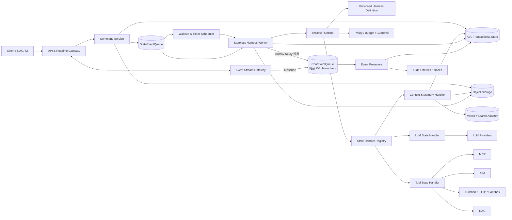

整体分为四个平面：

- **接入平面**：命令、查询、上传和实时事件订阅。
- **控制平面**：Chat/Run 生命周期、状态机、调度、租约、策略和配额。
- **执行平面**：无状态 Worker、模型调用、工具执行、记忆检索与生成。
- **数据平面**：KV、ChatEventQueue、StateEventQueue、对象存储，以及可选的向量/全文索引。

## 4. DDD 领域划分

### 4.1 Conversation 上下文

负责用户可见的会话语义。

- 聚合：`Chat`
- 实体：`Message`、`ContentPart`
- 值对象：`ChatId`、`MessageId`、`Participant`、`MediaRef`
- 职责：接收用户输入、维护消息顺序、关联 Run、生成会话视图。

`Chat` 是交互容器，不直接承担执行锁和状态机版本控制。一个 Chat 可包含多个顺序或并行 Run，具体并发策略由租户策略决定。

### 4.1.1 ChatContextTree：Git 式上下文树

Chat 的上下文不是一条只能追加的线性日志，而是一棵 **Git 风格的上下文树（ChatContextTree）**，规则如下：

- **不可变节点**：每个节点是一次上下文提交（用户消息、模型响应、Run 边界、摘要、检查点），内容寻址，写入后不可修改——与事件不可变原则（§8.2）一致。
- **单父约束**：每个节点**恰好一个父节点**（根节点除外）。树而非 DAG：不提供 merge，任何节点的祖先路径唯一，上下文组装无歧义。
- **分支指针**：分支只是指向某个节点的命名指针（类似 Git ref）；`HEAD` 是当前活跃分支。默认分支为 `main`。
- **编辑/重新生成 = 开新分支**：用户编辑历史消息或要求重新生成时，从该节点 fork 出新分支继续，历史分支原样保留、可回看、可切换。Run fork（§16 Phase 3）也以节点为分叉点。
- **上下文组装**：为 Run 组装上下文时，从分支 tip 向根回溯，按预算（token/费用）进行选择、截断与摘要——这直接回应 §17 风险 4 的上下文膨胀问题。
- **摘要节点**：长分支可沉淀摘要节点；摘要经用户确认后可晋升为 MemoryRecord，`provenance` 指向源节点（见 §4.7）。
- **在途 Run 与分支切换**：`checkout` 只移动活跃分支指针，**不中止在途 Run**。Run 在其创建时绑定的分支上写入节点，分支 tip 的推进以节点 `parentId` 引用的 CAS 收敛——并发编辑产生的新分支不会抢占在途 Run 的写入目标；新 Run 总是从当前活跃分支的 tip 创建。

### 4.2 Harness Definition 上下文

负责 Harness（状态机）的编排、发布和版本治理。

- 聚合：`HarnessDefinition`
- 实体：`StateNode`、`TransitionRule`、`RequirementSpec`
- 值对象：`HarnessVersion`、`CapabilitySpec`、`TimeoutPolicy`、`RetryPolicy`
- 职责：定义校验、版本发布、迁移兼容性和定义解析。

Harness Definition 只声明每个状态的**逻辑能力需求**（`RequirementSpec`），不引用任何具体 Handler 实现——实现的选择发生在 Run 创建时，由 Handler Registry 调度式解析完成（见 §7.2）。

已发布的 Harness Definition 不可变。Run 创建时固定 `harness.id + harness.version`，避免运行过程中因定义被编辑而改变语义。新版本通过新 Run、显式迁移或 fork 生效。

### 4.3 Execution Configuration 上下文

负责描述一次 Run 使用哪些能力与策略，核心概念为 `ExecutionProfile`。

- 聚合：`ExecutionProfile`、`Agent`
- 值对象：`ProfileVersion`、`ModelPolicy`、`ToolPolicy`、`MemoryPolicy`、`BudgetPolicy`
- 职责：配置继承、覆盖、版本发布、动态路由策略和 Run 启动时解析。

`Agent` 是**具名的执行人格**：一组默认 `ExecutionProfile` 引用、默认 Harness Definition 引用、系统指令与工具可见性范围。它是配置的容器与解析链的一环，**不是执行体、不持有 Run 状态**；同一个 Agent 可并发服务多个 Chat。Chat 可以绑定一个 Agent，也可以不绑定而直接使用租户默认。

Chat 可以引用一个默认 `ExecutionProfile`；创建 Run 时按 `Platform Default < Tenant < Agent < Chat < Run Override` 解析为不可变的 `ResolvedExecutionProfile`。Run 保存逻辑 Profile 引用、解析后的版本与非敏感快照。配置修改默认只影响新 Run；运行中变更必须通过显式 Signal 生成新的 `profileRevision`。

`ExecutionProfile` 表示“使用什么能力和策略”，Harness Definition 表示“如何流转”，Run Context 表示“执行过程中产生的数据”。实际模型可以由 Profile 中的 `ModelPolicy` 动态路由，但每次 Attempt 必须记录最终 Provider、Model、参数、Profile Revision 和路由原因。

### 4.4 Orchestration 上下文

平台核心域，负责把 Agent Loop 表达为确定性的持久状态机。

- 聚合：`Run`
- 实体：`Step`、`Checkpoint`
- 值对象：`RunLifecycleStatus`、`TerminalReason`、`StateVersion`、`ExecutionBudget`、`WakeupCause`
- 职责：选择下一迁移、维护不变量、暂停/恢复/取消、失败重试、提交检查点。

`Run` 是主要一致性边界。每次迁移必须基于期望的 `stateVersion` 做条件写入；同一版本最多有一个提交者成功。

**`Checkpoint`** 是 Run Context 的**低成本续跑锚点**，与 Snapshot 职责不同：

- **Snapshot**（§8.1）是每次迁移都写的控制状态，只含调度所需的小字段（当前状态、版本、预算、绑定）。
- **Checkpoint** 是较大体量的执行上下文快照（累积的消息窗口、变量、中间产物引用），**按策略周期性或按需写入**（如每 N 步、每次进入等待态、或定义显式声明 `checkpoint: true`）。
- 用途：加速恢复（避免从事件流重放数十步）、支持 Run fork/replay（§16 Phase 3）与人工诊断。
- Checkpoint **不是权威来源**：它可以从事件流与 Snapshot 重新推导；损坏或缺失只影响恢复速度，不影响正确性。因此它存放在对象存储而非 KV（Snapshot 里的 `checkpointRef` 只是引用）。
- 定义层可通过 `checkpointPolicy` 关闭它（如每步都极廉价的短流程），关闭时恢复退化为事件重放。

### 4.5 Execution Target 上下文

负责可执行目标 Device 及其 Workspace 的注册、在线状态、能力声明和会话绑定。

- 聚合：`Device`、`Workspace`
- 实体：`DeviceSession`、`CapabilityAdvertisement`、`WorkspaceBinding`
- 值对象：`DeviceId`、`WorkspaceId`、`DeliveryMode`、`ConnectivityStatus`、`SessionEpoch`
- 职责：Device 身份、能力注册、心跳、PUSH/PULL 投递、Workspace 挂载、Chat 绑定和执行目标解析。

`Device` 是能够实际执行工具的计算载体，例如本地 PC、Linux 主机、容器、边缘设备或托管 Runner。`Workspace` 是对话可操作的资源作用域，主要包含文件、代码库和工作目录，也可以包含进程或环境引用。一个 Device 可以暴露多个 Workspace；一个 Chat 可以绑定一个主 Workspace 和若干附加 Workspace。

Linux 主机本身可作为 Device，并将某个目录或仓库注册为 Workspace。因此 Workspace 不承担执行，Device 承担执行；Workspace 只限定“在哪组资源上执行”。

### 4.6 Tool Execution 上下文

负责外部工具的注册、发现、授权与执行，并统一 TOOL、MCP、A2A、HTTP、Serverless Function、沙箱函数和人工审批。

- 聚合：`ToolRegistration`、`ToolInvocation`
- 实体：`ToolDefinition`、`ToolEndpoint`、`ToolRevision`
- 值对象：`ToolId`、`ToolDescriptor`、`InvocationId`、`IdempotencyKey`、`CapabilityGrant`
- 职责：外部工具注册、协议发现、版本管理、健康检查、租户可见性、参数校验、权限检查、同步/异步执行、回调关联和结果标准化。

`ToolDefinition` 描述稳定的工具名称、能力和输入输出 schema；`ToolRegistration` 表示某个租户/平台接入的具体端点、协议、凭证引用和策略；`ToolInvocation` 是一次执行。三者分离，避免工具端点或凭证变更污染历史 Run。

工具调用和 Run 解耦：状态机只引用逻辑 `toolId`。Tool Handler 解析出允许使用的 Registration Revision，创建 Invocation 后可立即进入等待；工具结果以事件唤醒 Run。

### 4.7 Memory 上下文

负责工作记忆与长期记忆的生命周期。

- 聚合：`MemoryRecord`
- 类型：对话摘要、事实、用户偏好、任务经验、实体关系。
- 职责：抽取、检索、合并、衰减、删除、来源追踪和访问控制。

Memory 不是原始历史的替代物。每条长期记忆必须保留 `provenance`、作用域、生成时间、置信度与可撤销标记。

### 4.8 Artifact 上下文

负责大对象与生成产物。**Artifact 是逻辑资源**：用户上传的文件与执行生成的产物统一抽象为 Artifact，领域层、Harness Definition 和事件只持有 `ArtifactRef`——引用不包含物理位置、bucket 或厂商信息。物理存放由 ObjectStore Adapter 决定，随 Assembly 替换（all-in-one 可用本地磁盘或 MinIO，distributed 用 S3/OSS/GCS），业务代码无感知。

- 聚合：`Artifact`
- 值对象：`ArtifactRef`、`ContentDigest`、`MediaType`、`RetentionPolicy`
- 职责：分段上传、内容寻址、版本、元数据、签名访问、病毒/内容扫描和生命周期管理。

### 4.9 Event & Subscription 上下文

负责事件规范、持久化、投影和订阅。

- 聚合：`EventStream`
- 值对象：`EventId`、`Sequence`、`Cursor`、`CausationId`、`CorrelationId`
- 职责：Run 内严格排序、断点续传、投影、实时推送和审计导出。

### 4.10 Platform 上下文

支撑多租户和运营治理，包括租户、身份、策略、密钥、配额、计费、插件注册、模型目录和可观测性。

## 5. 可编排状态机与 `onState` 内核

### 5.1 Harness Definition

状态机不是写死的 Agent Loop，而是经过校验、编译和版本化的声明式定义，称为 **Harness Definition**。可以通过 JSON/YAML DSL、可视化编排器或代码 Builder 生成同一种规范化 IR（Intermediate Representation）。运行时只读取 IR，不解释任意用户代码。

Harness Definition 只描述**逻辑需求**，不绑定任何具体 Handler——这与 Kubernetes 的调度模型同构：定义像 Pod Spec 一样声明“这个状态需要什么能力”，真实环境中由哪个 Handler 模块处理该状态，取决于注册中心里当前可用的候选（见 §7.2）。

每个状态节点至少声明：

- `type`：`normal`、`wait`、`branch`、`terminal` 四种。**不设 `parallel`/`join` 类型**——并行在两个更合适的层次表达：跨 Run 并行由"一个 Chat 可包含多个 Run"承载（§4.1）；单状态内的扇出/扇入由 Handler 自己完成（如 `tools.invoke-all` 并发调用 N 个工具再汇聚结果），对内核仍是一次有界迁移。这样内核无需维护跨状态的 join 计数器与部分完成状态，与"单步执行"和"Handler 不决定下一状态"两条原则一致。
- `sideEffect`：该状态对**外部世界**的变更等级——`pure`（不改变外部世界）、`idempotent`（改变，但可安全重复）、`non-idempotent`（改变，且不可重复）。**只有 `pure` 允许内联快路径；改变世界的状态一律两相派发。** 三条规则完全一致：`pure` 可内联可自动重试；`idempotent` 必须两相、但可自动重试；`non-idempotent` 必须两相且禁止盲目重试。它**只回答"重复/超前执行会不会让世界变错"，不回答"要花多少钱"**——成本由预算单独把关（见 §5.3.2）。缺省为 `non-idempotent`（保守）。
- `onFailure`：Handler 失效时的处置策略——`fail`（默认）、`rebind`、`degrade`（见 §7.2）。
- `requires`：消费该状态所需的**逻辑能力声明**——capability ID、兼容版本范围、必需特性（如 streaming、tool-calling）与可选约束（如部署形态）。
- `inputMapping/outputMapping`：从 Run Context 读取和写回的数据映射。
- `transitions`：基于 Handler Outcome 或外部 Signal 的迁移规则。
- `timeouts`：排队、执行、心跳、回调及状态总时限。
- `retry`：可重试错误、次数、退避、抖动和 exhausted 去向。
- `policy`：预算、权限、并发、数据范围和审批要求。

示例定义：

```yaml
id: default-agent-loop
version: 1.2.0
initial: hydrate
states:
  hydrate:
    type: normal
    sideEffect: pure
    requires:
      capability: harness/context.hydrate
      version: ^1
    timeouts: { execution: 10s }
    on:
      succeeded: call-model
      failed: failed
  call-model:
    type: normal
    sideEffect: pure            # 模型调用不改变外部世界:内联快路径,不经 Effect Ledger
    onFailure: rebind
    requires:
      capability: harness/llm.invoke
      version: ^2
      features: [streaming, tool-calling]
    config: { provider: tenant-default, model: reasoning-default }
    timeouts: { execution: 120s }
    retry: { maxAttempts: 3, backoff: exponential }
    on:
      toolRequested: call-tools
      completed: persist
      failed: failed
      timedOut: model-timeout
  call-tools:
    type: wait
    sideEffect: non-idempotent   # 工具可能改变外部世界:必须两相派发,禁止内联
    onFailure: fail
    requires:
      capability: harness/tools.invoke-all
      version: ^1
    timeouts: { execution: 60s, callback: 30m, state: 2h }
    on:
      succeeded: call-model
      approvalRequired: wait-approval
      failed: failed
      timedOut: tool-timeout
  wait-approval:
    type: wait
    sideEffect: pure
    requires:
      capability: harness/signal.wait
      version: ^1
    timeouts: { state: 24h }        # 等待态也必须有总时限,否则违反"超时覆盖"发布校验
    on:
      approved: call-tools
      rejected: persist
      timedOut: persist             # 审批超时视同拒绝
```

发布前必须验证：入口与终态存在、迁移目标有效、不可达节点、无界自动循环、超时覆盖、重试上限、输入输出 schema 兼容性，以及每个 `requires` 在语法上可解析。**发布时不检查 Handler 是否存在**——定义是与运行时环境解耦的逻辑制品；可用性检查发生在对话启动时（见 §7.2）。

### 5.2 `onState` 执行契约

Worker 本质上只执行一个通用入口：

```text
onState(StateExecutionContext context, StateSignal signal) -> StateOutcome
```

其中：

- `StateExecutionContext` 包含不可变的 Harness Definition 版本、Run Snapshot、当前节点、尝试次数、预算、授权上下文以及必要数据引用。
- `StateSignal` 是本次唤醒原因，例如 `entered`、`model.completed`、`tool.callback`、`timer.fired`、`approval.decided` 或 `cancel.requested`。
- `StateOutcome` 只能返回结构化结果：`succeeded`、`waiting`、`retryableFailure`、`terminalFailure`、`cancelled`，以及 Context Patch、Domain Events、Effects 和下次唤醒要求。

**三套状态枚举的分工**（不要混用）：

| 层次 | 枚举 | 取值 | 谁关心 |
|---|---|---|---|
| Handler 返回值 | `StateOutcome` | `succeeded` / `waiting` / `retryableFailure` / `terminalFailure` / `cancelled` | 内核据此匹配 Transition Rule |
| Run 调度态 | `lifecycleStatus` | `RUNNABLE` / `WAITING` / `BLOCKED` / `TERMINAL` | 调度、运维、Reconciler |
| Run 终局 | `terminalReason` | `COMPLETED` / `FAILED` / `CANCELLED` / `TIMED_OUT` | 审计、客户端、不变量 #2 |

三者的**推导方向是单向的**：内核由 `StateOutcome` + Transition Rule 得出下一状态，再据此设置 `lifecycleStatus`（`waiting` → `WAITING`；其余继续流转 → `RUNNABLE`；到达 `terminal` 状态 → `TERMINAL` 并附 `terminalReason`）。Handler **不得**直接设置后两者，否则控制流就绕过了 Transition Rule。

`waiting` 是一个**不迁移**的 Outcome：Run 停留在 `currentState` 并置 `WAITING`，等待下一次 Signal——它不需要在 `transitions` 中另配规则。这正是 `type: wait` 状态的常规路径，也是 `EffectLedger(PENDING)` 能与 `lifecycleStatus = WAITING` 在同一个事务里提交的原因（§5.3.2）。

Handler 不直接决定下一个状态。内核用 `StateOutcome` 匹配 Harness Definition 中的 Transition Rule，计算并提交下一状态。这样相同的 `llm.invoke` Handler 可被不同状态机复用，也可以在不修改内核的情况下替换为另一实现。

### 5.3 一次无状态迁移

1. Worker 从 StateEventQueue 收到只包含 `runId`、Signal 摘要和去重键的 `RunWakeup`。
2. 以 `runId` 获取短租约，并取得单调递增的 fencing token。
3. 从 KV 读取 Run Snapshot、固定版本的 Harness Definition、待接收 Signal 和 `stateVersion`。Harness Definition 已发布不可变（§4.2），Worker 进程内**按 `harnessId + version` 缓存**（可无 TTL 失效，或对未固定版本用短 TTL + ETag 校验），避免每次唤醒多一次回源读；Run Snapshot、Inbox、Effect Ledger 永不缓存——它们是每次 CAS 的裁决对象。
4. 内核从 Snapshot 的 `resolvedBindings` 取出当前节点**已固定**的绑定，构造受限的 `StateExecutionContext`。迁移过程中**不得重新解析**——Registry 只参与 Run 创建时的调度式解析，以及 `onFailure: rebind` 触发的重新解析（§7.2）。
5. 调用 `handler.onState(context, signal)`。若当前状态 `sideEffect: pure`，Handler **直接内联调用** Provider/Tool 并在 Outcome 中回报结果与 usage（不经 Effect Ledger）；否则 Handler 只**声明意图**——同步 Outcome 或待执行的 Effect 列表（含 `effectId`、幂等键、deadline），**不在此阶段执行任何改变外部世界的动作**（见 §5.3.2）。
6. 内核依据 Outcome 和 Transition Rule 计算下一状态。
7. 在同一原子提交中写入 Snapshot、Context Patch、Inbox 消费标记、Effect Ledger（`PENDING`）、Step、定时器意图、事件索引和 Outbox，条件为 `stateVersion` 未变化且 fencing token 有效。
8. 提交成功后，Effect Dispatcher 依据 Effect Ledger 派发 `PENDING` 意图；Outbox Relay 向 ChatEventQueue 发布领域事件、向 StateEventQueue 发布唤醒提示；Worker 释放租约。

**自续跑（internal continuation）**：若提交后的 `lifecycleStatus` 为 `RUNNABLE`——即 `hydrate → call-model` 这类**没有任何外部事实**的内部推进——内核必须在**同一事务内**向 Inbox 写入一条 `entered` Signal（`dedupeKey = {runId}/{stateVersionAfter}`），再由 Outbox Relay 发出唤醒提示。**不存在绕过 Inbox 的唤醒路径**：否则 §5.3.1 的"Inbox 是消费的权威来源"对内部推进不成立，重复提示会重复推进状态，消息丢失也无人兜底。`entered` 因此与其他 Signal 一样参与去重、CAS 竞争与 `stateVersion` 裁决。

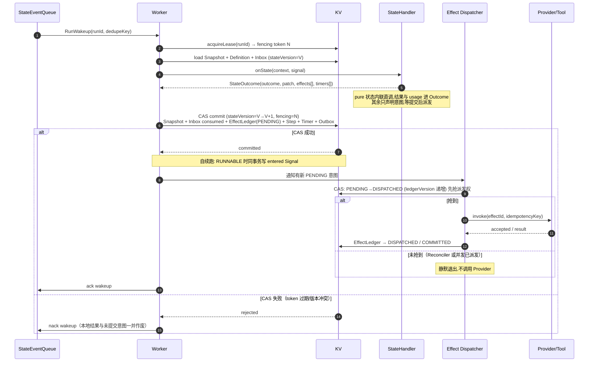

关键约束：CAS 提交是**唯一裁决点**，且**改变世界的动作不早于提交**（不变量 #9）。`sideEffect: pure` 的状态不受此限：它不改变世界，内联调用自然可发生在提交前，代价仅为"CAS 失败时这次计算白做"（见 §5.3.2）。派发权另有一次独立 CAS（`effectId + ledgerVersion`）——Run 状态的 CAS 不保护 Effect 的派发权（不变量 #11）。

迁移完成后，任何 Worker 本地内存都不是恢复所必需的。StateEventQueue 消息是“有新事实可处理”的提示，KV 中的 Snapshot、Inbox 和 Effect Ledger 才决定应该处理什么；因此队列重复投递不会重复推进状态，消息短暂丢失也可由 Reconciler 根据 KV 中的未完成意图重新唤醒。

### 5.3.1 Signal Inbox 与合并语义

所有唤醒事实（用户输入、工具回调、定时器、审批、取消、以及内核自身的 `entered` 自续跑 Signal）先持久化到 Run 维度的 **Inbox**，再向 StateEventQueue 发提示。Inbox 才是消费的权威来源，队列消息只是提醒。

- **去重**：同一 `dedupeKey`（如 `inv_.../completed`）的 Signal 只入队一次；重复回调、重投消息在入队阶段即被折叠。自续跑 Signal 的 `dedupeKey` 为 `{runId}/{stateVersionAfter}`，保证每个状态实例至多被续跑一次。
- **领取**：Worker 每次迁移从 Inbox 原子领取待处理 Signal，领取动作与状态提交在同一 CAS 事务内完成——提交成功才标记 consumed，保证 Signal 不丢失、不重复生效。
- **批次**：默认一次迁移消费一个 Signal；同类可合并 Signal（如同一 Invocation 的重复心跳）允许在领取时折叠为一个批次。
- **优先级**：`cancel.requested` 与 `runDeadline` 到期优先于其他待处理 Signal；取消一旦提交，Inbox 中剩余 Signal 全部转为 late event 处理。
- **乱序**：Signal 携带 `occurredAt` 与来源序列号，但裁决不依赖到达顺序，而依赖**相关资源的版本 CAS**——Run 状态看 `stateVersion`、Invocation 看 `invocationVersion`、Effect 派发看 `ledgerVersion`。先提交者定义事实，后到者只记录为 late event。

### 5.3.2 Effect 派发：意图先于副作用

**改变外部世界**的 Effect 分两相执行，顺序不可颠倒：

**相位 1（决策与提交）**：`onState` 不直接执行对外动作，只声明**意图**——`effectId`、类型、参数（或参数引用）、幂等键、deadline。内核把 `EffectLedger(PENDING)` 与 Snapshot、Inbox 消费标记、Timer、Outbox 放入**同一个 CAS 事务**提交。

**相位 2（派发与回执）**：提交成功后，Effect Dispatcher 才读取 `PENDING` 记录并调用 Provider/Tool；受理后转 `DISPATCHED`，结果回执转 `COMMITTED`。CAS 失败的 Worker **不得派发**——它产生的意图随事务一起作废。

这条顺序保证不变量 #9（未提交的迁移不产生**对外的**副作用）：**世界不会先于账本改变**。代价是即使同步完成的调用也要跨两次迁移，因此不改变外部世界的状态不必付这个代价：

**内联快路径（不经 Effect Ledger）。** 当且仅当 `sideEffect: pure` 时，Handler 在 `onState` 内部**直接调用** Provider/Tool，把结果放进 Outcome，**不为它写 Effect Ledger、不产生第二次迁移**——该调用不改变世界，因此不存在"世界已变而状态未提交"的窗口。其成本与调用痕迹由 Handler 在 Outcome 中回报，写入 Step 记录（§8.4）。

判据必须分成两道闸，由不同字段回答：

| 闸门 | 由谁回答 | 不通过时的行为 |
|---|---|---|
| **安全闸**：重复/超前执行会不会让世界变错？ | `sideEffect` | 非 `pure` 一律两相派发，意图经 Effect Ledger |
| **成本闸**：这次调用花得起吗？ | 预算 `BudgetPolicy`（同一 Step 内按已花 + 预估上限累加） | **不创建该 Effect**，走定义中的预算分支迁移（§11.3）；与"内联还是两相"无关 |

三级声明各有一项、且只有一项特权——规则压缩成一句话：**不改变世界就能内联，改变世界就必须两相**：

| `sideEffect` | 内联 | 自动重试 | 特权 |
|---|---|---|---|
| `pure` | ✅ 直调，不经 Ledger | ✅ 安全 | 省掉一次迁移与一次 KV 往返 |
| `idempotent` | ❌ 必须两相 | ✅ 安全（重放收敛） | 免去 `recover` 确认即可重试 |
| `non-idempotent` | ❌ 必须两相 | ❌ 禁止盲目重试，须先 `recover/status` | 无（最保守的默认值） |

**为什么 `idempotent` 不能内联。** 内联的本质是"调用发生在提交之前"，唯有**不改变外部世界**时才无害。`idempotent` 改变世界，只是重复可收敛——"世界已变、状态未提交"的窗口依然存在。而判断它能否内联需要知道适配层是否真的实现了幂等去重，这是**运行时无法验证**的声明。规则不能建立在不可验证的声明上，故 `idempotent` 与 `non-idempotent` 一视同仁。

**模型调用是 `pure`，且很贵。** 一次 LLM 调用不改变外部世界，却花真实的 token 费用：它过安全闸、内联执行，由成本闸单独把关。**这正是"贵"与"危险"必须分开表达的原因**——若把成本顾虑塞进 `sideEffect`（例如把 `call-model` 写成 `idempotent` 以图规避），得到的是语义上错误的声明：调模型既不改变世界，也不存在"重复等价于一次"。

**计费口径：只认已提交的 Step 记录。** Step 写在 CAS 提交事务内，失败的 Attempt 不落 Step，因此"只计已提交 Step"天然排除了无效工作，无需任何额外标识协议。由此得到明确的会计口径——**并发竞争导致的重复执行，其成本由平台承担，不计入 Run 的 `budget` 与租户账单**。这是正确而非宽容：重复执行是"至少一次投递 + CAS 裁决"这套可靠性机制的固有开销，转嫁给用户既不公平，也会让用户预算随平台内部竞争率波动。内联调用不写 Effect Ledger，其成本经 Outcome 的 usage 落入 Step 记录，与两相路径口径统一。

`sideEffect: non-idempotent` 的判定与 §11.3 的"不确定结果"一致：既不内联，也不允许盲目重试。**内联的唯一条件是 `pure`，无例外**（不变量 #9）。

### 5.4 Handler 与 Effect 的边界

Handler 是状态消费插件，Provider 是 Handler 使用的能力适配器，两者不可混为一层：

```text
Run State
  -> StateHandler.onState()
      -> zero or more capability ports / Effects
          -> Provider Adapter
```

例如 `llm.invoke` Handler 负责组装上下文、流式事件、工具请求解析和 Outcome 归一化；`ModelProvider` 只负责某个模型协议的调用。替换 Model Provider 不影响状态逻辑，替换 `llm.invoke` Handler 则可以整体改变模型消费策略。`tools.invoke-all` 与 `ToolProvider` 同理。

Handler 触碰外部世界的方式分两类，**只有第二类才是 Effect**：

- **`pure` 状态的直调**（不经 Effect Ledger）：`InvokeModel`、`SearchMemory`、只读查询。它们是 Handler 内部的调用，不是 Effect——因为不改变外部世界（§5.3.2）。
- **改变世界的 Effect**（必须经 Effect Ledger，两相派发）：`InvokeTool`（可能产生外部变更的工具）、`StoreArtifact`、`SendNotification`、`ChargePayment`、`RequestApproval`。

判定标准是**该动作是否改变外部世界**，而不是它是否昂贵或异步。每个 Effect 携带稳定的 `effectId` 与幂等键；适配器必须接受幂等键，或由 Effect Ledger 屏蔽重复执行。

### 5.5 默认 Agent Loop 只是一个模板

平台可内置 `hydrate -> llm -> tools -> llm -> persist` 模板，但它不属于内核硬编码。其他 Harness Definition 可以实现纯 Workflow、RAG Pipeline、多 Agent 协作、人工审批流或无 LLM 的自动化流程。内核只认识状态、Signal、Outcome、迁移和 Effect。

## 6. 数据与存储架构

### 6.1 KV：权威运行状态与查询视图

KV 至少存储：

- `RunSnapshot/{tenantId}/{runId}`：当前状态、版本、预算和绑定（不含待处理列表，见下）。
- `Lease/{tenantId}/{runId}`：持有者、过期时间、fencing token。
- `Inbox/{tenantId}/{runId}/{sequence}`：待处理 Signal，含去重键、优先级与消费标记（见 §5.3.1）。
- `EffectLedger/{tenantId}/{runId}/{effectId}`：Effect 意图、派发状态与结果引用（见 §8.6）。
- `Step/{tenantId}/{runId}/{stepSeq}`：每次状态迁移的 Attempt 记录（见 §8.4）。
- `ChatView/{tenantId}/{chatId}`：消息索引、活跃 Run 和最新游标。
- `Branch/{tenantId}/{chatId}/{branchId}`：分支指针（tip、fork 源、状态），见 §4.1.1。
- `EventIndex/{tenantId}/{streamId}/{sequence}`：事件元数据与小事件载荷。
- `Idempotency/{tenantId}/{scope}/{key}`：命令和副作用去重结果。
- `Outbox/{tenantId}/{partition}/{id}`：待发布事件。
- `Timer/{tenantId}/{timerId}` 与 `TimerIndex/{dueBucket}/{shard}/{dueAt}/{timerId}`：持久定时器意图与到期扫描索引（见 §8.7）。`dueBucket` 按到期时间分桶（如 10s 桶），扫描器只扫当前桶；`shard` 为有限常量分片，把同一时刻到期的 Timer 打散到 N 个键区间,消除高并发下的单点扫描热点。桶宽与分片数是 Assembly 配置,不进入领域模型。
- `ToolInvocation/{tenantId}/{invocationId}`：调用状态和回调关联。
- `ToolRegistration/{tenantId}/{registrationId}/{revision}`：规范化工具定义、端点引用、能力和状态。
- `HandlerRegistry/{handlerId}`：Handler 注册表、心跳与吊销名单（见 §7.2）。

**租户前缀是强制的**（`TimerIndex`、`HandlerRegistry` 例外：前者是跨租户的到期扫描索引,其值携带 `tenantId`;后者是部署级控制面元数据,不属于任何租户——二者的值都必须携带 `tenantId` 或以部署级主体限定访问）。理由：只有统一前缀才能支持按租户枚举、导出与合规删除；缺失租户维度的键会让"删除某租户全部数据"退化为全库扫描。

**Run 快照不内嵌待处理列表**。把待处理项（Invocation / Timer / Effect）编成数组内嵌 Snapshot，会在长 Run 上无界膨胀并把每次迁移的写放大推向 O(Run 全部历史)。改为：待处理项各自成键（`Timer`、`Invocation`、`EffectLedger`），Snapshot 只保存**计数与水位**（如 `pendingCount`、`oldestPendingAt`）；需要枚举时按 `runId` 前缀扫描。Reconciler 的扫描正是基于这些独立键，而非 Snapshot 内嵌数组。

KV Adapter 需要提供条件写、事务批次或等价的 compare-and-swap 能力。仅有最终一致性的 KV 不适合作为 Run 聚合的唯一权威存储。

### 6.2 双队列：ChatEventQueue 与 StateEventQueue

平台使用两条职责分离的事件通道，而不是一个通用 MQ：

| | ChatEventQueue | StateEventQueue |
|---|---|---|
| 职责 | 全部领域事件的权威分发（`message.*`、`run.*`、`artifact.*`、`memory.*`、模型增量） | Harness 内部状态事件中转（`run.wakeup`、`timer.fired`、Signal 提示） |
| 消费者 | Projector、SSE/WebSocket 推送、审计导出、外部订阅 | Harness Worker、Scheduler |
| 消息特征 | 可能很大（工具结果、产物描述），需要较长保留 | 小、延迟敏感、可丢弃 |
| 丢失影响 | 不可接受——但权威来源是 EventIndex/Outbox，可重建 | 可接受——Inbox 才是真相，Reconciler 兜底 |
| 保留期 | 按租户策略（小时~天），长期回放依赖 EventStore 归档 | 短（分钟级即可） |

**ChatEventQueue 内嵌 KV（claim-check）。** Kafka、Redis Stream 等 MQ 对单条消息有大小限制，该限制不得泄漏到领域层。ChatEventQueue 组件在写入侧检测超阈值事件：payload 自动落入其**内部封装的 KV**（大对象转对象存储），总线上只流转 Envelope + `payloadRef`；消费侧按引用透明取回。Event Envelope schema（§8.2）因此始终稳定，与底层是 Kafka、Pulsar 还是 Redis Stream 无关。该内嵌 KV 是队列组件的实现细节，逻辑上不属于 §6.1 的权威状态键空间（物理上可共享集群，键前缀隔离）。

**StateEventQueue 只做提示。** 它不承载任何不可丢失的事实：唤醒语义已由 Inbox（§5.3.1）持久化，StateEventQueue 消息重复或丢失都不影响正确性，只影响推进延迟。因此它可以选择更轻量的实现（NATS、Redis Stream），不必与 ChatEventQueue 同构。

生产者分流规则：

- 状态迁移提交后，Outbox Relay 把领域事件发到 **ChatEventQueue**，把“有新事实”的唤醒提示发到 **StateEventQueue**；
- Command/API 层创建 Signal 时先写 Inbox，再向 StateEventQueue 发提示；
- 定时器、回调、外部系统结果同样遵循“先 Inbox，后提示”。

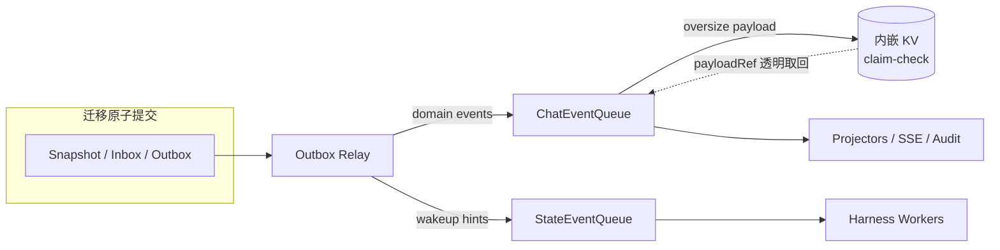

建议以 `tenantId + runId` 作为两条队列的**路由键**（保证同一 Run 的消息哈希到同一分区,单分区内 FIFO）。**分区数是按吞吐规划的有界常量**（如 64/256）,与 Run 数量无关——千万级 Run 落入有限分区复用;单个 Run 的权威有序性不依赖队列分区,而由 EventIndex 的 `sequence` 与 Inbox 的裁决保证,因此"多 Run 共享一个分区"只是吞吐权衡,不构成正确性风险。系统不能假定队列永不重复或永久保留，因此消费方必须幂等，长期回放依赖 EventStore/KV 索引和对象存储归档。

### 6.3 对象存储：不可变大对象

以下内容进入对象存储：原始媒体、超阈值消息内容、模型大响应、工具 stdout/stderr、大型工具结果、状态机检查点归档和最终产物。

对象引用至少包含：

```json
{
  "bucket": "logical-bucket",
  "key": "tenant/chat/run/artifact/version",
  "version": "provider-version",
  "sha256": "...",
  "size": 1234,
  "mediaType": "application/json",
  "encryptionKeyRef": "..."
}
```

领域层只识别 `ArtifactRef`，不感知 bucket、预签名 URL 或具体厂商 SDK。

### 6.4 事件一致性

采用“聚合状态 + 本地事件索引 + Outbox”原子提交：

- KV 中的 Run Snapshot 是当前控制状态的权威来源。
- Event Stream 是历史事实与客户端增量的权威来源。
- ChatEventQueue / StateEventQueue 是分发机制，不单独承担永久事实存储。
- Projector 可随时从持久事件重建查询视图。
- 对象存储通过内容摘要校验完整性，引用只有在对象写入成功后才能进入已提交事件。

不跨 KV、队列和对象存储做分布式事务，而使用 Saga、Outbox、幂等写和补偿清理实现最终一致。

## 7. 可插拔端口与适配器

可插拔能力分为三类，生命周期和职责不同：

1. **Harness Definition**：描述“有哪些状态以及如何迁移”。
2. **State Handler Plugin**：消费某类状态，实现 `onState` 语义。
3. **Infrastructure/Capability Adapter**：为 Handler 提供模型、工具、存储等底层能力。

领域与应用层只依赖以下端口：

| 端口 | 关键能力 | 适配器示例 |
|---|---|---|
| `HarnessDefinitionRepository` | publish、resolve、validate、version | KV、Git-backed Registry、配置中心 |
| `StateHandlerRegistry` | register、resolve、capabilities、health | 进程内模块、远程 Handler、WASM/沙箱插件 |
| `StateHandler` | onState、cancel、recover、describe | LLM、Tool、RAG、Memory、Approval Handler |
| `StateStore` | get、CAS、transaction、lease、fencing | SQLite(WAL)、FoundationDB、DynamoDB、PostgreSQL；Redis 需同步复制配置 |
| `EventStore` | append、read、cursor、archive | KV+Blob、Kafka tiered storage、EventStoreDB |
| `ChatEventQueue` | publish、subscribe、retention、claim-check 封装 | Kafka + 内嵌 KV、Pulsar、Redis Stream + KV |
| `StateEventQueue` | publish、subscribe、delay、DLQ | NATS、Redis Stream、SQS |
| `ObjectStore` | put/get/head、multipart、signed access | S3、OSS、GCS、MinIO |
| `ModelProvider` | complete/stream、cancel、usage | OpenAI-compatible、云模型、自建模型 |
| `ToolRegistry` | register、discover、resolve、revision、health | KV-backed Catalog、服务注册中心 |
| `ToolExecutor` | invoke、cancel、recover、callback | MCP、A2A、HTTP、Function、Sandbox |
| `MemoryStore` | upsert、search、delete、scope filter | Vector DB、全文检索、关系数据库 |
| `TimerService` | schedule、cancel、fire | 云调度器、延迟队列、时间轮 |
| `SecretProvider` | resolve、rotate、audit | KMS/Vault/云密钥服务 |
| `AuthnAuthz` | authenticate、authorize、audit-decision | 进程内策略引擎、OPA、云 IAM；**框架不内置身份源**,未绑定实现的 Assembly 必须显式声明"拒绝匿名" |
| `Telemetry` | trace、metric、log、audit | OpenTelemetry 兼容后端 |

插件以 manifest 注册，声明稳定 ID、语义版本、可消费的 capability、输入/输出 schema、配置 schema、所需系统 Capability、超时/取消/恢复能力、部署模式、健康检查和兼容范围。**两种 manifest 的关系**：§7 的 Handler manifest 是**运行时注册**（面向 Registry，声明能力与健康，决定能否被发现和绑定）；§14.1 的 `component.yaml` 是**构建期装配**（面向组合根与 Assembly 校验，声明 Port 依赖与 Binding 需求，决定能否被编译进同一进程）。二者由构建工具生成/校验，同一组件的两份声明必须一致——`component.yaml` 中 `provides` 的 Port 即 Registry 中可被解析的 capability。Harness Definition 不包含任何 Handler 引用；可用性在对话启动时 Validate，绑定在 Run 创建时由调度式解析生成 ResolvedBinding 并随 Snapshot 固定（见 §7.2）。

Handler 支持两种部署形态：

- **进程内 Handler**：低延迟，通过 SDK 接口加载，但必须受执行时限约束。
- **远程 Handler**：通过标准协议消费状态任务，适合独立扩缩容、强隔离或不同语言实现；结果通过带签名的 Signal 返回。

领域对象和持久事件中不得保存云厂商 SDK 类型。应保存逻辑 Handler/Provider ID、解析版本和非敏感配置快照，以满足审计和重放。

### 7.1 `StateHandler` 最小接口

```text
interface StateHandler {
  describe() -> HandlerDescriptor
  onState(context, signal) -> StateOutcome
  cancel(executionRef, reason) -> CancelAck
  recover(executionRef) -> RecoveryStatus
}
```

`onState` 不得在本地持有恢复所必需的隐式状态。若执行不能在一次 Worker 调用内完成，Handler 必须将必要状态写入 Invocation/Artifact，并返回 `waiting + executionRef`。`cancel` 是尽力而为；`recover` 用于 Worker 崩溃后查询外部执行状态或重新建立回调。

### 7.2 Handler 中心注册、凭证与调度式解析

Handler 的信任与可用性模型与 Kubernetes 同构：**Handler Registry 是中心控制面**，所有 Handler（进程内或远程）必须先注册，才能被发现、被绑定、被允许写入 MQ。

这里的"中心"是**部署内中心**：v1 的 Registry 服务于一个部署的信任域，Handler 身份、JWT 签发与吊销均以该部署为边界（跨部署的全局注册属后续演进，见 §1）。因此 §12 的凭证治理针对的是"部署内不受信任的组件与远程 Handler"，而非"不受信任的外部平台用户"。

**1. 注册（Register）。** Handler 启动时向中心 Registry 提交 manifest：稳定 ID、语义版本、可消费的 capability 列表（含 features）、输入/输出 schema、部署形态（in-process / remote）、健康端点。注册成功后 Registry 签发 Handler 身份与初始凭证，Handler 进入 `active` 候选集。未注册的 Handler 对控制面与 MQ 均不可见。

**2. 心跳与短期凭证（Heartbeat + Token Refresh）。** Registry 签发的是 **JWT 短期凭证（TTL 1 小时）**，claims 包含 `kind`（`handler`、`platform` 或 `device`，见 §12/§7.4）、`handlerId`、`handlerVersion`、capabilities、租户作用域与 `jti`。Handler 必须周期心跳（远小于 TTL，默认 **15 分钟**，即 TTL/4，并加抖动）：心跳同时完成"存活续租"与"凭证滚动刷新"。心跳停止后凭证自然过期，Registry 将 Handler 标记为 `stale` 并从候选集摘除——无需显式注销，未授权写入的爆炸半径被 TTL 封顶。

**3. MQ 写入鉴权。** Handler 向 MQ 写入任何消息（状态结果、Signal 回传、进度事件）时必须在消息元数据中携带有效 JWT；MQ Gateway/Bridge 校验签名、过期时间、audience 与 `handlerId` 归属后才接受投递。进程内 Handler 由运行时注入凭证，远程 Handler 自行持有并刷新。凭证过期或 Handler 已注销的写入一律拒绝并告警。

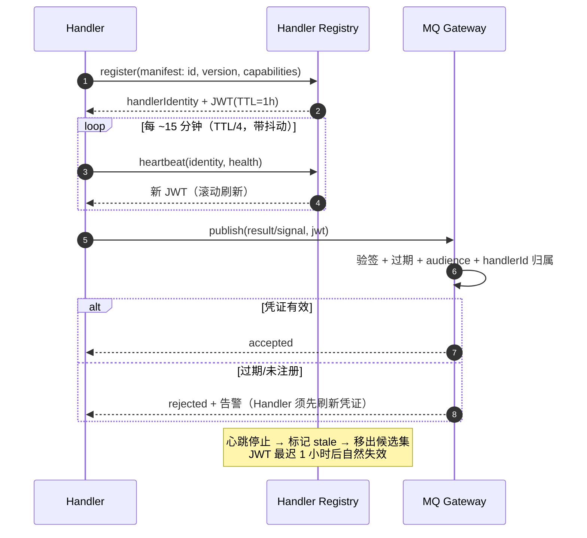

**4. 对话启动时 Validate。** Chat 创建（或绑定 Harness Definition）时，控制面依据 Registry 当前状态校验定义中每个 `requires` 至少存在一个 `active` 且租户策略允许的候选 Handler；校验失败立即报错，不等到 Run 中途才发现无可用实现。声明 `bindPolicy: wait` 的定义允许进入 pending-bind 等待候选上线（默认 `fail-fast`）。

**5. 调度式解析（Resolve & Bind）。** Run 创建时，解析器对每个状态执行一次“调度”：

```text
requires(capability + version + features + constraints)
  -> Registry 候选（active + 能力匹配 + 特性全覆盖）
  -> 租户策略过滤（allow/deny、部署形态、区域）
  -> 选择（本地优先、健康优先、版本最新；并列时按策略打分）
  -> ResolvedBinding{ state, handlerId, handlerVersion, deployment }
```

解析结果写入 Run Snapshot 后**在 Run 生命周期内默认固定**：同一次 Attempt 不因注册表变化中途切换实现。

**失效处置（onFailure）** 是定义层的显式策略，而非解析器的自由裁量——这解决了"绑定固定"与"故障转移"的冲突：

| `onFailure` | 行为 | 适用 |
|---|---|---|
| `fail`（默认） | 按 Retry Policy 重试同一绑定版本；耗尽后走 `failed` 迁移 | 需要严格可重现的流程 |
| `rebind` | 同一状态在 Handler 被摘除（`stale`/`revoked`）且重试耗尽后，**重新解析**并生成新 Attempt | 高可用优先的内部流程 |
| `degrade` | 迁移到定义中声明的备用状态（`fallback: <state>`） | 有明确降级路径的流程 |

`rebind` 与 `degrade` 都**必须产生新的、带审计的 Attempt**，记录原绑定、新绑定与触发原因；二者都不允许在单次 Attempt 中途静默切换。Provider 层面的解析同理在 Handler 内按租户策略完成，路由结果写入 Step/Invocation。

**6. Registry 自身的高可用模型。** Registry 是中心控制面,但**不是运行时热路径**——认清它故障时阻断什么、不阻断什么,才能正确投入冗余:

- **无状态多副本**:Registry 不持有独占状态,全部注册表、心跳与吊销名单存于共享 KV(同一 §6.1 键空间,前缀 `HandlerRegistry/`);副本可水平扩展,心跳与注册请求可打到任意副本。分布式 Assembly 中 Registry 随 `harness-service` 部署多副本。
- **JWT 采用非对称签名(如 Ed25519/ES256),MQ Gateway 与 API 通过 JWKS 离线验签**:验签只依赖公钥缓存,**不调用 Registry**。因此 Registry 全体故障时——在途 Run 照常迁移(Worker 不询问 Registry,§5.3 步骤 4 读 `resolvedBindings`)、MQ 写入照常验签、凭证在续期前照常可用;被阻断的只有**新 Handler 注册/心跳续租、新 Run 创建时的调度式解析、吊销名单增量**。心跳停止只影响候选集新鲜度,不影响已固定绑定。
- **吊销名单的可用性兜底**:短 TTL 吊销名单同样存共享 KV,MQ Gateway 缓存并周期拉取(间隔 ≤ TTL/4);Gateway 与 KV 同时故障时按"拒绝写入"处理(fail closed),不回退为"信任所有未过期凭证"。
- **故障恢复**:Registry 无状态,恢复即拉起副本接上 KV;唯一需要人工介入的是签名密钥轮换中断(§12 的双公钥窗口期覆盖)。

由此 Registry 的可用性目标可与 KV 同级——它是控制面元数据的写入点,不是执行平面的依赖。

### 7.3 工具的三个正交维度

工具不按 MCP、Workspace、Device 划分为互斥类型，而是由三个正交维度描述：

| 维度 | 可选值示例 | 回答的问题 |
|---|---|---|
| `protocol` | MCP、A2A、HTTP、Native、Function | 使用什么协议调用 |
| `executionTarget` | Cloud Endpoint、Device | 在哪里执行 |
| `resourceScope` | None、Workspace、Device、External Resource | 操作哪些资源 |

由此得到：

- **MCP Tool**：`protocol=MCP`。可以调用云端 MCP Server，也可以由某个 Device 上的 MCP Executor 执行。
- **Device Tool**：`executionTarget=Device`。由 Device 注册或发布能力，一般通过 PULL 执行，也可以使用 PUSH。
- **Workspace Tool**：本质是 `executionTarget=Device + resourceScope=Workspace` 的 Device Tool，执行时必须携带有效 Workspace Binding。

例如“在本地 PC 修改仓库文件”可表示为：

```yaml
toolId: harness/workspace.file.patch
protocol: native
executionTarget:
  kind: device
  selector: chat-primary-device
resourceScope:
  kind: workspace
  selector: chat-primary-workspace
deliveryModes: [pull]
```

而“在 Linux Device 上启动一个 MCP 工具”可以同时具有 `protocol=MCP`、`executionTarget=Device` 和 `resourceScope=Workspace`。分类不会互相覆盖或产生特例。

### 7.4 Device、Workspace 与能力注册

Device 首次接入时注册稳定身份和设备元数据；每次连接生成新的 `DeviceSession + sessionEpoch`，防止旧连接或离线 Agent 提交过期结果。Device 周期性发布不可变版本的 `CapabilityAdvertisement`：

**Device 身份与凭证。** Device 是不受控网络环境中的主体,必须有独立身份核验,与 Handler/平台主体并列(见 §12):

- **Enrollment（首次注册）**：管理操作,须持有预置的 enrollment token 或 mTLS 客户端证书(租户管理员预先签发/登记),并校验设备指纹与域名/网络策略;开放注册等价于向任意主机发放执行能力,默认禁止。
- **运行期凭证**：注册成功后走与 Handler 相同的短期 JWT 路径,claims 标注 `kind: device`、`deviceId`、`sessionEpoch` 与租户作用域,TTL 与刷新节奏同 §7.2(TTL 1h,心跳 TTL/4)。
- **回传校验**：`invocations:report` 端点验签后还须校验 JWT 中 `deviceId + sessionEpoch` 与 Invocation 记录绑定的 Device 会话一致——旧 epoch 的连接即使凭证未过期,其回传也按 late event 处理;`sessionEpoch` 递增即宣告旧会话全部作废。

```yaml
deviceId: dev_local_pc_01
sessionEpoch: 38
agentVersion: 1.6.0
deliveryModes: [pull]
capabilities:
  - toolId: harness/workspace.file.read
    protocol: native
    requiresWorkspace: true
  - toolId: harness/workspace.shell.exec
    protocol: native
    requiresWorkspace: true
  - toolId: harness/browser.navigate
    protocol: native
    requiresWorkspace: false
workspaces:
  - workspaceId: ws_repo_01
    kind: git
    rootRef: opaque-local-ref
    permissions: [read, write, execute]
```

Workspace 的真实绝对路径属于 Device 本地信息，控制面只保存不透明 `rootRef`、能力、版本和策略，不把本地路径暴露给模型。Chat 通过 `WorkspaceBinding` 绑定 Workspace：

```text
Chat -> WorkspaceBinding -> Workspace -> Device
```

绑定记录包含 `chatId`、`workspaceId`、`deviceId`、权限、有效期和 binding revision。Run 启动时把所用 binding revision 固定到 Resolved Execution Profile；同一 Workspace 迁移到另一 Device 时必须产生新 Binding Revision。

### 7.5 外部工具注册模型

外部工具通过 `Tool Registry` 注册，不要求与 Harness 使用相同语言或部署在同一网络。注册支持两种来源：

- **协议发现**：给出 MCP/A2A 等服务端点，由 Registry 拉取能力清单和 schema。
- **显式 Manifest**：注册 HTTP、Function、异步 Webhook 等工具时直接提交规范化描述。

规范化注册对象示例：

```yaml
toolId: acme/issue.create
revision: 7
scope: tenant/t_123
protocol: mcp
endpointRef: endpoint/tool-server-a
credentialRef: secret/tool-server-a
inputSchemaRef: artifact://schemas/create-issue-v3.json
outputSchemaRef: artifact://schemas/issue-result-v2.json
execution:
  mode: async-capable
  idempotency: supported
  cancel: supported
  recover: supported
  heartbeat: 30s
policy:
  risk: write-external
  approval: conditional
status: active
```

注册流程为：

1. 调用方提交 Endpoint、协议、凭证引用、租户作用域和可选 Manifest。
2. Registry 验证身份与域名/网络策略；协议支持时执行 discovery。
3. 对 Tool ID、schema、协议能力、回调地址和幂等能力做校验。
4. 生成不可变 `ToolRevision`，写入 Registry 并发布 `tool.registered` 事件。
5. 异步执行健康检查；只有 `active` 且被 Execution Profile 允许的工具可进入模型工具清单。

更新工具会创建新 Revision，不能原地修改历史版本。禁用或删除注册会阻止新 Invocation；进行中的 Invocation 按原 Revision 完成、取消或超时。凭证只保存 `credentialRef`，Registry、事件和 Run Snapshot 中不得保存明文 Secret。

### 7.6 外部工具执行模型

`tools.invoke-all` Handler 的执行流程为：

1. 根据 `tenantId + toolId + ExecutionProfile.toolPolicy` 解析 Registration Revision。
2. 执行权限、参数 schema、预算、风险和审批检查。
3. 创建持久化 `ToolInvocation` 与稳定 `idempotencyKey`。
4. 通过对应协议的 `ToolExecutor` Adapter 执行；同步完成则直接归一化结果，异步受理则持久化 `externalExecutionRef` 并进入等待。
5. 将大结果写入对象存储，只把摘要和 ArtifactRef 写入事件。
6. 回调、轮询、心跳、取消和恢复都转换成 Invocation Signal，再由 Run 的 `onState` 处理。

Harness Definition 和 LLM 只能看到规范化 Tool Descriptor，不直接接触 Endpoint、Credential 或 Executor。每次 Invocation 固定 `toolId + registrationId + revision + executorVersion`，保证注册更新后仍能审计当时实际调用的工具。

### 7.7 QName 命名约定

系统级资源（内置状态能力、Handler、工具、事件类型等）一律使用 **QName**：`{ns}/{name}`。规范分隔符为 `/`；解析时同时接受 `ns:name` 作为输入别名，但存储、事件与审计中一律使用规范形式 `ns/name`。

- **`harness` 为系统保留命名空间**：平台内置的能力与工具均以其为前缀，如 `harness/llm.invoke`、`harness/tools.invoke-all`、`harness/bash`、`harness/workspace.file.patch`。只有平台组件可以注册 `harness/*`。
- **用户扩展使用 `user` 命名空间**：个人级扩展默认落在 `user/*`，如用户自己实现的 `user/bash`——它与 `harness/bash` 同名不同空间，互不冲突，也不允许隐式 shadowing，引用必须写完整 QName。
- **租户/组织扩展使用自有命名空间**（建议取组织标识，如 `acme/issue.create`）；Registry 在注册时强校验，拒绝任何非平台来源的 `harness/*` 注册请求。
- **命名空间即治理边界**：租户策略按命名空间授权（allow/deny），配额与审计按命名空间统计；跨命名空间引用必须在 ExecutionProfile 中显式允许。
- **版本不编码进 QName**：兼容范围由 `requires.version` 与 Registration Revision 表达（见 §5.1、§7.5），名称保持稳定。

由此，模型可见的工具清单是命名空间化的——内置 shell 工具呈现为 `harness/bash`，用户扩展呈现为 `user/bash`，租户自研的工单工具呈现为 `acme/issue.create`，来源与信任级别一目了然。

## 8. 核心数据模型

### 8.1 Run Snapshot

```json
{
  "tenantId": "t_...",
  "chatId": "c_...",
  "runId": "r_...",
  "lifecycleStatus": "WAITING",
  "terminalReason": null,
  "currentState": "call-tools",
  "stateVersion": 17,
  "harness": {
    "id": "default-agent-loop",
    "version": "1.2.0"
  },
  "executionProfile": {
    "id": "chat-default-profile",
    "revision": 12,
    "snapshotRef": "artifact://profiles/run-profile.json"
  },
  "resolvedBindings": {
    "hydrate":    { "handlerId": "harness/context.hydrate",  "handlerVersion": "1.1.0", "deployment": "in-process" },
    "call-model": { "handlerId": "harness/llm.invoke",       "handlerVersion": "2.3.0", "deployment": "remote" },
    "call-tools": { "handlerId": "harness/tools.invoke-all", "handlerVersion": "1.3.2", "deployment": "in-process" }
  },
  "activeHandler": {
    "id": "harness/tools.invoke-all",
    "version": "1.3.2"
  },
  "lastAcceptedSequence": 42,
  "stateEnterCounter": 4,
  "pendingCount": 1,
  "oldestPendingAt": "...",
  "checkpointRef": "artifact://...",
  "budget": {
    "maxSteps": 100,
    "maxTokens": 200000,
    "maxCostMicros": 5000000,
    "deadline": "..."
  },
  "updatedAt": "..."
}
```

`currentState` 来自 Harness Definition，不是平台枚举；平台只固定 `lifecycleStatus` 与 `terminalReason`（取值与推导关系见 §5.2 的三层枚举表）以便调度和运维。`stateEnterCounter` 在**每次进入一个新状态时递增**（同一状态内的重复迁移不递增），是 Timer 与迟到 Signal 判断"是否仍属于当前状态实例"的依据（见 §8.7）。`resolvedBindings` 在 Run 创建时由 §7.2 的调度式解析生成并固定；`activeHandler` 记录本次 Step 实际执行的实现，取自 `resolvedBindings`。待处理 Invocation / Timer / Effect 各自成键，Snapshot 只保留计数与最老水位（见 §6.1）。

### 8.2 Event Envelope

```json
{
  "eventId": "evt_...",
  "eventType": "harness/tool.invocation.completed",
  "tenantId": "t_...",
  "streamId": "run/r_...",
  "sequence": 43,
  "occurredAt": "...",
  "correlationId": "r_...",
  "causationId": "evt_...",
  "producer": "harness/tool-executor",
  "schemaVersion": 1,
  "payload": {},
  "artifactRefs": [],
  "traceContext": {},
  "securityContext": {}
}
```

**版本只声明一次**：`eventType` 使用 QName（§7.7）且**不含版本后缀**，版本统一由 `schemaVersion` 表达。这消除了"`...completed.v1` + `schemaVersion: 1`"的双重版本化——两者一旦不同步即产生歧义。事件一经提交不可原地修改；敏感字段通过加密引用、可销毁密钥或可擦除的外部 payload 满足删除要求。

### 8.3 Tool Invocation

一次工具执行至少记录：

```json
{
  "invocationId": "inv_...",
  "tenantId": "t_...",
  "runId": "r_...",
  "toolId": "acme/issue.create",
  "registrationId": "tr_...",
  "registrationRevision": 7,
  "executor": { "id": "mcp", "version": "1.4.0" },
  "status": "RUNNING",
  "attempt": 1,
  "idempotencyKey": "...",
  "externalExecutionRef": "...",
  "inputRef": "artifact://...",
  "resultRef": null,
  "deadlines": { "heartbeat": "...", "callback": "..." }
}
```

Invocation 固定 Registration Revision；注册信息后续更新或禁用不会改变该 Invocation 的历史语义。

### 8.4 Step / Attempt

每次状态迁移（含重试）落一条不可变记录，是审计、计费和回放的基本粒度：

```json
{
  "runId": "r_...",
  "stepSeq": 17,
  "attempt": 1,
  "state": "call-tools",
  "handler": { "id": "harness/tools.invoke-all", "version": "1.3.2" },
  "signalIds": ["sig_..."],
  "startedAt": "...",
  "finishedAt": "...",
  "outcome": "waiting",
  "stateVersionBefore": 16,
  "stateVersionAfter": 17,
  "usage": { "tokens": 0, "costMicros": 0 },
  "invocations": [
    {
      "kind": "InvokeModel",
      "provider": "openai-compatible",
      "model": "reasoning-default",
      "modelVersion": "2026-05-01",
      "params": { "temperature": 0.2, "maxTokens": 4096 },
      "profileRevision": 12,
      "routeReason": "tenant-default",
      "callPath": "pure-inline",
      "externalExecutionRef": null
    }
  ],
  "traceId": "..."
}
```

`attempt > 1` 表示同一 Step 的重试；只有 CAS 提交成功的 Attempt 才拥有 `stateVersionAfter`。失败 Attempt 同样保留，用于诊断重复投递与冲突率。

`invocations` 是**每次 Attempt 实际发生的外部调用痕迹**，满足 §4.3 对"最终 Provider、Model、参数、Profile Revision 与路由原因"的记录要求。`callPath` 取 `pure-inline`（内联直调）或 `effect-ledger`（两相派发），使两种路径的审计信息等价——否则内联调用将成为审计盲区（见 §5.3.2）。`pure` 状态可能在一个 Step 内多次调用（如内联重试），故为数组。

`usage` 与 `invocations` 是**汇总与明细**的关系，不重复计费：`usage.costMicros` 恒等于 `invocations` 中已完成调用的成本之和。审计读明细，计费读汇总（§13 的成本账本直接投影 `usage`）。

### 8.5 Inbox Entry

```json
{
  "signalId": "sig_...",
  "runId": "r_...",
  "sequence": 43,
  "type": "tool.completed",
  "dedupeKey": "inv_.../completed",
  "priority": "normal",
  "payloadRef": "artifact://...",
  "occurredAt": "...",
  "consumedByStep": null
}
```

Signal 一经入队不可修改；`consumedByStep` 由消费它的迁移在同一事务内写入。

### 8.6 Effect Ledger Entry

```json
{
  "effectId": "eff_...",
  "runId": "r_...",
  "kind": "InvokeTool",
  "status": "PENDING",
  "ledgerVersion": 1,
  "intentRef": "artifact://...",
  "idempotencyKey": "r_.../step17/eff_...",
  "dispatcherRef": null,
  "resultRef": null,
  "createdAt": "...",
  "resolvedAt": null
}
```

状态机：`PENDING → DISPATCHED → COMMITTED`，补偿路径为 `DISPATCHED → COMPENSATED`。Effect 意图与 Run 状态在同一事务提交；**派发前** Ledger 条目必须处于 `PENDING`（即意图已随事务落账），未落账或已终态的条目不得派发；结果回写后转为 `COMMITTED`。

**派发权必须被裁决，不能只靠"谁看见谁执行"。** 正常路径的 Effect Dispatcher 与 §10.3 的 Reconciler 会同时看到同一条 `PENDING`（或超时的 `DISPATCHED`）记录。因此 Ledger 自身的状态迁移也是一次 CAS：**只有把 `PENDING → DISPATCHED`（或超时 `DISPATCHED → DISPATCHED` 重派）抢先提交成功的执行者获得派发权**，落败方静默退出、不调用 Provider。该 CAS 以 `effectId + ledgerVersion` 为条件，与 `stateVersion` 相互独立——`stateVersion` 保护 Run 状态，`ledgerVersion` 保护"至多一次派发"（不变量 #4、#11）。**顺序是先抢令牌、再调 Provider**，不是先调用再回写。`dispatcherRef` 记录胜出者身份，用于诊断并发派发竞争。

### 8.7 Timer Intent

```json
{
  "timerId": "timer_...",
  "runId": "r_...",
  "kind": "callback",
  "dueAt": "...",
  "signalType": "timer.fired",
  "stateVersionAtSchedule": 17,
  "enteredAtCounter": 4,
  "status": "SCHEDULED"
}
```

状态机：`SCHEDULED → FIRED | CANCELLED`。Timer 到期只向 Inbox 写入普通 Signal；该 Signal 是否有效由消费时与当前状态实例的匹配决定——Run 已离开相关状态时，迟到的 Timer Signal 被直接丢弃并记录。

**判据是状态实例，不是 `stateVersion`。** 同一状态内的每次内部迁移都会递增 `stateVersion`，因此用版本号判断"Timer 是否仍属于当前状态"会把仍然有效的 Timer 误判为过期。正确的做法是在 Snapshot 中维护一个 **`stateEnterCounter`**：**仅在进入一个与前一状态不同的状态时递增**（`currentState` 发生变化的迁移才 +1；`waiting` 后原地重入同一状态、同一状态内的重复迁移都不递增）。Timer 记录 `enteredAtCounter`；消费时若 `enteredAtCounter != 当前 stateEnterCounter` 则该 Timer 已属于上一个状态实例，直接丢弃。这与 §5.3.1 的裁决一致：**迟到的 Timer 不是错误，只是一次被丢弃的 late event**。

### 8.8 ChatContextNode 与 Branch

```json
{
  "nodeId": "ctx_...",
  "chatId": "c_...",
  "parentId": "ctx_...",
  "kind": "message",
  "messageRef": "m_...",
  "runRef": "r_...",
  "payloadRef": "artifact://...",
  "tokenCount": 1234,
  "digest": "sha256:...",
  "createdAt": "..."
}
```

`parentId` 仅根节点为 null，其余节点恰好一个父节点（单父约束，见 §4.1.1）；`kind ∈ message | run-boundary | summary | checkpoint`。节点内容寻址、不可变；大载荷经 `payloadRef` 引用 Artifact。

分支是可变指针（类似 Git ref），移动分支指针不改变任何节点：

```json
{
  "branchId": "b_...",
  "chatId": "c_...",
  "name": "main",
  "tipNodeId": "ctx_...",
  "forkedFrom": null,
  "status": "active"
}
```

切换分支（checkout）只改变 Chat 的活跃分支标记；fork 从任意历史节点创建新分支，源分支不受影响。

## 9. 接口与交互协议

### 9.1 Command API

- `POST /v1/chats`
- `POST /v1/chats/{chatId}/messages`
- `POST /v1/chats/{chatId}/runs`
- `POST /v1/chats/{chatId}/workspace-bindings`
- `POST /v1/chats/{chatId}/branches`（从指定节点 fork，见 §4.1.1）
- `POST /v1/chats/{chatId}/branches/{name}:checkout`（切换活跃分支指针）
- `GET /v1/chats/{chatId}/branches`
- `POST /v1/runs/{runId}:cancel`
- `POST /v1/runs/{runId}:resume`
- `POST /v1/runs/{runId}:fork`（可选，从当前状态或指定 Step 分叉，见 §4.1.1）
- `POST /v1/harness-definitions`
- `POST /v1/harness-definitions/{harnessId}:publish`
- `POST /v1/handlers/register`（Handler 注册，返回身份与初始 JWT）
- `POST /v1/handlers/{handlerId}/heartbeat`（存活续租 + 滚动刷新 JWT）
- `POST /v1/handlers/{handlerId}:deregister`
- `POST /v1/execution-profiles`
- `POST /v1/execution-profiles/{profileId}:publish`
- `POST /v1/devices/register`（Device Agent 调用）
- `POST /v1/devices/{deviceId}/heartbeat`（携带 `sessionEpoch` 与 CapabilityAdvertisement）
- `POST /v1/devices/{deviceId}/invocations/{invocationId}:report`（Device PULL 执行结果回传）
- `POST /v1/tool-registrations`
- `POST /v1/tool-registrations/{registrationId}:publish`
- `POST /v1/tool-registrations/{registrationId}:disable`
- `POST /v1/tool-registrations/{registrationId}:refresh-discovery`
- `POST /v1/tool-invocations/{invocationId}:callback`
- `POST /v1/approvals/{approvalId}:decide`
- `POST /v1/artifacts:prepare-upload`

**API 层通用契约**：

- **`Idempotency-Key` 作用域为 `(tenantId, principal)`**：同一键只在同一主体对同一端点的语义内去重，键内记录绑定参数摘要;不同主体撞键视为不同命令。作用域条目按租户保留期清理。
- **列表查询统一 cursor 分页**（`?limit=&cursor=`，cursor 为服务端签发的不透明令牌），禁止无界全量枚举。
- **限流与配额前置**：按租户/主体维度对命令与订阅端点强制限流（令牌桶），超限返回 `429` + `Retry-After`，不进入命令处理。
- API 返回已接受的命令、资源 ID 和事件游标，不承诺 Run 在请求连接内完成。

### 9.2 Query 与 Stream API

- `GET /v1/chats/{chatId}`
- `GET /v1/runs/{runId}`
- `GET /v1/runs/{runId}/events?after={cursor}`
- `GET /v1/runs/{runId}/steps`
- `GET /v1/runs/{runId}/invocations`
- `GET /v1/runs/{runId}/effects`（Effect Ledger 视图：状态、派发者、重试次数；用于诊断停滞的 Effect）
- `GET /v1/runs/{runId}/inbox`（待处理与已消费 Signal，用于诊断 `BLOCKED` Run）
- `GET /v1/harness-definitions/{harnessId}/versions/{version}`
- `GET /v1/handlers?capability={capability}&status=active`
- `GET /v1/execution-profiles/{profileId}`
- `GET /v1/devices/{deviceId}`
- `GET /v1/tools?scope={scope}&status=active`
- `GET /v1/tool-registrations/{registrationId}`
- `GET /v1/artifacts/{artifactId}`
- `GET /v1/runs/{runId}/stream`（SSE）
- WebSocket 可用于多 Run 复用；SSE 是简单可靠的默认方案。

客户端必须按 `eventId` 去重，并保存 cursor 以支持断线续传。流式 Token 是可丢弃的体验数据时，也应在最终消息事件中提供规范化完整内容。

**Event Stream Gateway 的水平扩展模型**：网关本身完全无状态——SSE/WebSocket 连接不绑定任何 Worker 或 Run 租约，因此**无粘性会话要求**，副本可任意扩缩容。事件分发采用"ChatEventQueue consumer group + 推送"：每个网关副本订阅 ChatEventQueue,按订阅者过滤推送到其持有的连接;LB 对连接做普通轮询即可。**断线补齐走 EventIndex,不走连接**：客户端重连时携带 cursor,网关从 KV `EventIndex` 顺序读取 `after={cursor}` 的事件补发,再挂回实时流;连接内乱序/丢失由 `eventId` 去重兜底。这保证了"水平扩展任意副本数"与"逐 Run 有序"不冲突——有序性来自 EventIndex 的 sequence,而不是来自任何特定的网关或连接。

**流订阅鉴权**：`GET /v1/runs/{runId}/stream` 与 WebSocket 是普通授权对象——按租户/主体校验对目标 Run 的读权限(与 `GET /v1/runs/{runId}` 同一判定),拒绝时 403;cursor 为服务端签发的短期不透明令牌(内含租户与游标位置、带过期),防止枚举他人游标。

## 10. 关键执行流程

### 10.1 用户消息到最终响应

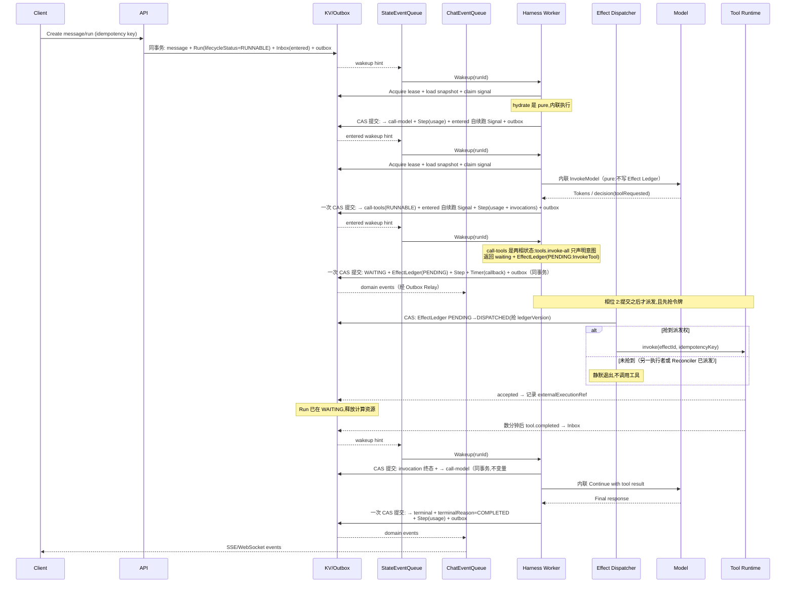

读图要点：模型调用是**内联**的（`pure`），因此 `call-model` 只产生一次 CAS 提交。工具调用是**两相**的（`non-idempotent`）：`tools.invoke-all` 在 `onState` 内只声明意图并返回 `waiting`，**`WAITING` 与 `EffectLedger(PENDING)` 在同一个事务里提交**；真正的 `invoke` 发生在提交**之后**，且必须先抢到 `ledgerVersion`。注意派发者是新图中的 `D`（Effect Dispatcher），不是持有租约的 Worker。`WAITING` 是 `lifecycleStatus` 的值，`call-tools` 是 `currentState` 的值——两者不是一回事（§5.2），且 `waiting` 是一个不迁移的 Outcome，不需要 `transitions` 规则。

### 10.2 长工具与人工审批

长工具返回 `accepted + invocationId` 后，Run 进入 `lifecycleStatus = WAITING`，`currentState` 停留在等待态（如 `call-tools`），等待 Invocation 的回调 Signal。回调入口验证签名、Invocation 状态和幂等键，将结果持久化到 Inbox 后发出唤醒提示。人工审批（`RequestApproval`）同样建模为一次特殊 Tool Invocation，其权限、过期与拒绝结果由策略定义；它**复用 `ToolInvocation/{tenantId}/{invocationId}` 键空间**（以固定的 `harness/approval` 伪工具 ID 区分），不引入独立的审计表。

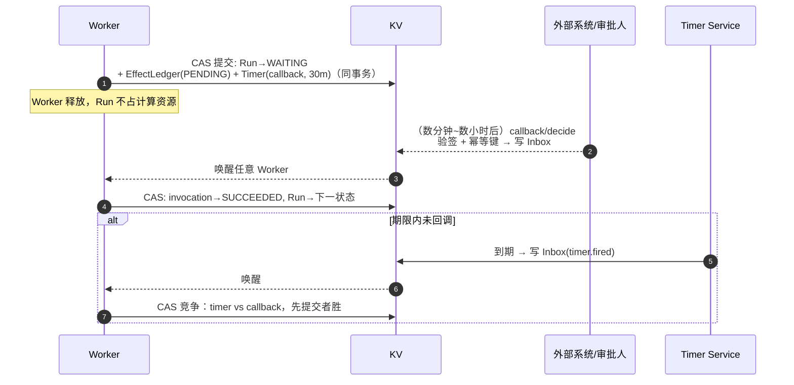

等待期间唯一的"活成本"是 KV 中的一条 Timer 记录——这正是"长任务释放计算"原则（§18）的落地形态。

### 10.3 超时、失联与恢复

超时不能依赖某个 Worker 内的内存定时器。Handler 创建异步 Invocation 时，必须把 deadline 和 `ScheduleTimer` 意图与 Run 状态一并提交；Timer Service 到期后发送普通的 `timer.fired` Signal，由同一个 `onState` 流程竞争处理。

需要区分以下超时：

| 超时类型 | 含义 | 默认处置 |
|---|---|---|
| `scheduleToStart` | 任务已入队但没有消费者领取 | 重新投递、扩容或熔断 Handler |
| `startToClose` | 单次 Handler/Provider Attempt 总执行时间 | 请求取消，按 Retry Policy 重试或迁移 |
| `heartbeat` | 长工具在窗口内没有续租/心跳 | 标记失联并调用 `recover` |
| `callback` | 已受理的外部调用未在期限内回调 | 查询 Provider；不可确认时进入人工处置或策略分支 |
| `state` | Run 停留在当前状态的总时长 | 触发定义中的 `timedOut` Transition |
| `runDeadline` | 整个 Run 的业务截止时间 | 进入取消/超时终态并停止创建新 Effect |

Timer Signal 与工具完成 Signal 可能并发到达，二者必须以 KV 的 `stateVersion + invocationVersion` 竞争提交：先提交者决定 Invocation 的规范结果，后到事件只记录为 late event，不得反向覆盖终态。**Invocation 的终态迁移与 Run 的状态迁移必须在同一个 CAS 事务内提交**——分两次提交会留下"Invocation 已终态、Run 仍在等待"的不一致窗口，Worker 在其中崩溃时 Reconciler 无法判定该 Run 的走向（不变量 #9 的直接推论）。

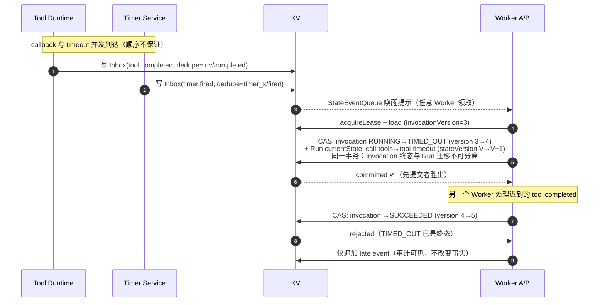

此规则对所有"竞态完成"统一成立：审批 vs 超时、取消 vs 成功、心跳恢复 vs 失联标记。裁决点是 CAS，而不是到达顺序或消息时间戳。

工具 Invocation 使用独立生命周期：

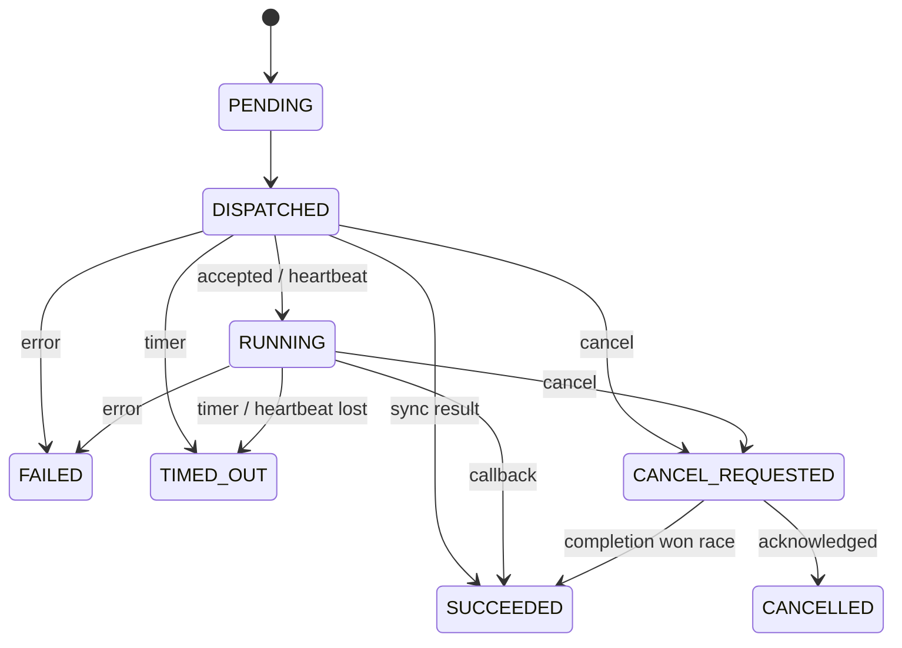

Reconciler 周期扫描 KV 中“存在未完成 Effect/Invocation，但没有有效 Timer、Outbox 或近期心跳”的记录，并重新发布唤醒或进入恢复流程。这条修复路径用于覆盖 Outbox Relay 长时间故障、Timer 丢失、回调丢失及 Worker 在外部调用成功后、提交结果前崩溃等场景。

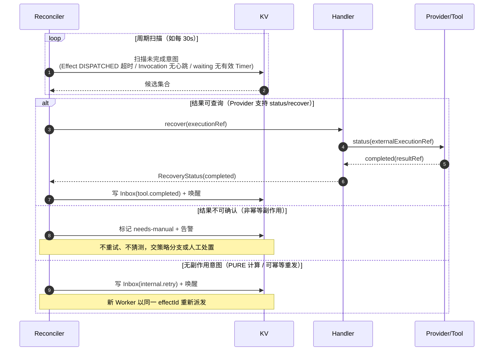

Reconciler 只做"重新唤醒"与"状态标记"，从不直接修改 Run 的业务状态；最终迁移仍由普通 `onState` 流程经 CAS 提交，保证恢复路径不绕过不变量。

## 11. 可靠性设计

- **并发控制**：租约减少冲突，CAS 决定最终提交权；fencing token 阻止过期 Worker 写入。
- **重复处理**：命令、事件、Effect、工具回调分别有独立幂等作用域。
- **重试**：只对明确的瞬时错误重试，使用指数退避与抖动；终态错误不自动循环。
- **不确定结果**：非幂等工具发生超时或断连时，必须先通过 `recover/status` 确认结果；不能盲目重试。
- **毒 Signal**：Signal 本身不可丢弃（否则 Reconciler 会反复唤醒）。同一 Signal 重试耗尽后，把 **Run 置为 `BLOCKED`**、停止对它的自动唤醒并告警，保留 Inbox、Step 与错误上下文供人工处置或显式 `resume`。DLQ 只适用于**可丢弃的提示消息**（StateEventQueue 的 `RunWakeup`）与无法归属到任何 Run 的畸形消息。
- **背压**：按租户、模型、工具和优先级设置队列与并发限制。
- **超时**：所有 deadline 持久化；Timer 只发 Signal，最终裁决通过 KV CAS 完成。
- **取消**：先将 Run 标记为取消中，再尽力取消模型/工具；迟到结果可审计但不能复活终态 Run。
- **灾难恢复**：KV 做时间点恢复，Event/Artifact 跨区域复制；恢复后通过 Outbox 和投影检查点继续。
- **Harness 升级**：Snapshot 保存精确的 `harness.id + harness.version`；新版本提供显式迁移器，运行中的 Run 不做隐式结构升级。
- **状态处理器升级**：Step 保存解析后的 `handlerId + handlerVersion`；进行中的 Attempt 不热切换 Handler。

### 11.1 可用性边界与故障行为

| 故障 | 系统行为 | 恢复机制 |
|---|---|---|
| StateEventQueue 暂时不可用 | 已接收命令和状态提交不丢失，但唤醒延迟 | Outbox Relay 恢复后补发；Reconciler 按 Inbox 兜底 |
| ChatEventQueue 暂时不可用 | 领域事件滞留 Outbox，客户端推送与投影延迟 | Relay 恢复后补发，Projector 从持久事件追平 |
| KV 不可用 | 停止状态迁移并拒绝确认消费，避免分叉 | 队列重投；KV 恢复后继续 |
| Worker 执行中崩溃 | 未提交的迁移无效，租约到期 | 队列重投或 Reconciler 唤醒 |
| 外部调用前崩溃 | Effect 仍为 pending | 新 Worker 以同一 `effectId` 派发 |
| 外部调用成功、提交前崩溃 | 结果可能不确定 | Provider 幂等键或 Handler `recover` 查询 |
| 回调丢失 | Run 保持 waiting | callback timer + recover + Reconciler |
| Timer 消息丢失/重复 | 不依赖单条 Timer 消息决定真相 | KV deadline 扫描；CAS 去重裁决 |
| Handler/Provider 故障 | 局部状态受影响，不阻塞其他 Handler 分区 | 隔离队列、熔断；按定义层 `onFailure` 策略重试/重绑/降级（见 §7.2） |
| Worker 滚动部署/缩容到零 | 已提交迁移不丢失;未领取的唤醒提示短暂滞留 | 部署前置条件:停止领取新唤醒(排空租约),在途租约自然到期后下线;StateEventQueue 的提示是可丢弃的,漏发的由 Reconciler 按 Inbox 兜底;缩容到零后由队列触发器重新拉起 |

命令 API 只有在“业务状态 + Inbox/Outbox”写入 KV 成功后才返回 accepted；Worker 只有在迁移事务提交成功后才确认队列消息。由此队列故障主要影响推进延迟，不应导致已提交状态丢失。KV 是控制面的正确性核心，应优先选择支持跨可用区复制和条件事务的实现；KV 不可用时系统 fail closed，不尝试依靠 Worker 内存继续推进。

### 11.2 系统不变量

以下不变量在任何故障、重试与乱序下都必须成立，是契约测试与故障注入的直接验证目标：

1. 同一 `runId` 的同一 `stateVersion` 最多有一个提交者成功。
2. 终局（`terminalReason` ∈ `COMPLETED` / `FAILED` / `CANCELLED` / `TIMED_OUT`）不可逆；迟到事件只记录为 late event。
3. Signal 进入 Inbox 后必然被消费或被显式丢弃（伴随审计事件），不存在静默丢失。
4. 已提交（`PENDING` 之后）的 Effect 必然被派发，且至多一次产生外部副作用；非幂等副作用由业务幂等键裁决。
5. 事件 `sequence` 在单个 Run 流内严格单调递增；允许因失败 Attempt 出现缺口，但已提交事件不得乱序或被改写。
6. 预算耗尽或 `runDeadline` 到期后，不再**创建**新的收费调用（含 `pure` 状态的内联直调）。已在途的调用不回溯撤销——它的成本仍会落入 Step 记录，但不会再发起新的 Effect。
7. Run Snapshot 引用的 `harness` / `resolvedBindings` / `executionProfile` 版本在 Run 生命周期内不发生变化；`rebind` / `degrade` 只能以新 Attempt 的形式改变绑定，且全程留痕。
8. 任何写入 KV、事件或日志的内容不落明文 Secret，只存 `credentialRef` / `encryptionKeyRef`。
9. 未提交的迁移不产生**对外的**副作用：任何改变外部世界的 Effect 必须先随事务落账为 `PENDING`，才允许被派发。例外仅为 `sideEffect: pure` 的内联调用（不改变世界，因此无"世界已变但状态未提交"之虞；其成本处理见 §5.3.2）。
10. 终态 Run 不接受任何新的 Signal 或 Effect 派发；迟到事实只追加审计记录。
11. **派发权唯一**：同一 `effectId` 的副作用至多由一个执行者发起。该裁决由 Effect Ledger 的 `effectId + ledgerVersion` CAS 完成，与 `stateVersion` 相互独立（见 §8.6）——Run 状态的 CAS 不保护 Effect 的派发权。
12. **状态迁移原子**：Invocation 终态、Effect 状态、Timer、Inbox 消费标记与 Run `stateVersion` 的变更要么全部提交、要么全部不生效；不允许出现"子资源已终态、Run 仍等待"的可观测中间态。
13. **内部推进不脱管**：任何 `RUNNABLE` 状态都有对应的 Inbox Signal（通常是 `entered` 自续跑）。系统不存在"已在 RUNNABLE 但没有终止性 Signal"的悬挂 Run——这正是 Reconciler 判定悬挂的依据。

### 11.3 错误分类

| 类别 | 示例 | 处置 |
|---|---|---|
| 瞬时错误 | 网络抖动、限流、Provider 5xx | 按 Retry Policy 指数退避 + 抖动重试 |
| 终态错误 | 参数校验失败、权限拒绝、内容拒绝 | 不重试，走定义中的 `failed` 迁移 |
| 不确定结果 | 调用发出后超时/断连 | 先 `recover/status` 确认，不得盲目重试 |
| 预算超限 | token / 费用 / 步骤 / deadline | 不创建新 Effect，走预算分支迁移 |
| 策略拒绝 | 审批拒绝、工具不在白名单 | 作为业务 Outcome，走策略分支 |
| 基础设施故障 | KV / 队列不可用 | fail closed，依赖重投与 Reconciler 恢复 |

Handler 必须把 Provider 的原始错误归一化为以上类别后再返回 Outcome；内核不解释厂商错误码。

## 12. 安全与治理

- 身份统一映射为 `tenant / principal / service`，授权在 API 和 Effect 执行前双重检查。
- Handler 必须经中心 Registry 注册并获得身份；未注册 Handler 的消息与回调一律拒绝（见 §7.2）。
- MQ 写入强制携带 Handler 短期 JWT（TTL 1 小时，心跳滚动刷新）；MQ Gateway 校验签名、过期、audience 与 `handlerId` 归属；心跳停止即自动失活，过期凭证的在途写入被拒绝并告警。
- **平台组件同样是 MQ 生产者，也必须持有身份。** Outbox Relay、Timer Service、Command/API Service 都会写入队列，但它们不是 Handler。做法是把它们注册为**平台 principal**（`harness/*` 命名空间下的服务身份），走同一套 JWT 签发与校验路径，claims 中标注 `kind: platform` 而非 `kind: handler`；MQ Gateway 按 `kind` 应用不同的授权规则（平台身份可写系统 topic，Handler 只能写其能力对应的话题）。**不存在匿名或携带长期静态密钥的写入者**——否则 §7.2 的"未注册即不可见"会出现一个特权旁路。
- JWT 签名密钥支持**分级轮换**：Gateway 同时接受当前与上一代公钥（按 `kid` 区分），轮换窗口长于最长 TTL，避免轮换瞬间全量 401。**验签强制算法白名单**：JWT header 的 `alg` 必须命中平台声明的非对称算法集合（如 `EdDSA`/`ES256`），显式拒绝 `none` 与一切 HMAC 对称算法——密钥体系是非对称的（§7.2 JWKS）,接受对称算法等于允许任何持有公钥者伪造凭证。
- 维护**短 TTL 吊销名单**（`jti`/`handlerId`，TTL = 凭证有效期），用于 Handler 泄露、越权或恶意行为时的**立即吊销**——不能只靠 TTL 自然过期。
- 心跳必须带**抖动**（如 TTL/4 ± 随机 20%），避免同一版本 Handler 在部署后形成同步刷新风暴打爆 Registry。
- 凭证只证明注册时声明的能力；能力、版本或部署形态变更必须重新注册，不得凭旧凭证提权。
- 工具采用最小权限 Capability Grant；Grant 限定工具、参数范围、资源、有效期和 Run。
- 外部工具注册默认不可信：限制协议、目标域名/IP、重定向、DNS 重绑定和网络出口，防止 SSRF 与内网探测。
- 工具 Endpoint 使用 TLS/mTLS 或请求签名；Callback 必须验证签名、时间窗、nonce、Invocation ID 和租户归属。
- Tool Registry 的注册、修改、启用和禁用是管理操作，必须经过独立权限与审计；工具自报 schema 不能自动获得更高权限。
- 租户密钥与平台密钥分离；传输和静态数据加密；对象访问使用短期签名凭证。
- 外部内容一律视为不可信数据，工具描述、RAG 文本和网页内容不能提升为系统指令。
- 对高风险工具支持人工审批、网络出口策略、沙箱、文件路径白名单和数据防泄漏检查。
- 审计记录身份、策略判定、模型/工具版本、输入摘要、费用和副作用结果。**审计流防篡改**：审计事件按 `sequence` 哈希链（每条记录含前一条摘要）写入,定期锚定到对象存储的不可变归档（WORM/对象锁）,篡改任何一条都会破坏链校验;对外提供链完整性校验接口。
- 流订阅与游标同样是授权对象：SSE/WebSocket 订阅按租户/主体校验目标 Run 的读权限,cursor 为服务端签发的短期令牌,禁止跨租户枚举（见 §9.2）。
- Memory 支持租户、用户、Chat 和 Agent 作用域，默认禁止跨租户检索。
- 数据保留、导出和删除通过 Policy 驱动，并处理派生索引、缓存和加密密钥。

## 13. 可观测性与成本

统一采用 `tenantId / chatId / runId / stepSeq / effectId / invocationId` 作为关联维度（`stepSeq` 对应 §8.4 的 Step 记录主键）。

关键指标：

- Run 成功率、端到端延迟、排队延迟、状态停留时间。
- 每 Run 的步骤数、Token、模型费用、工具费用和对象存储增量。
- 重复投递率、CAS 冲突率（Run / Invocation / Ledger 三类分别统计）、租约过期率、重试率、`BLOCKED` Run 数量与被丢弃的提示消息数。
- **有效工作量比**：已提交迁移数 / 总执行次数。该比值直接反映内联快路径在并发下的浪费程度——若明显偏离 1，说明竞争或租约配置需要调整（见 §13.1、§17 风险 10）。
- 工具/模型供应商的可用性、限流、首 Token 时间和响应时间。
- Memory 命中率、引用率、写入量和用户撤销率。

每次唤醒创建一个 Trace，使用 Span Link 连接跨暂停阶段的调用，避免把数小时 Run 强行建模为单个常驻 Span。**成本账本由已提交 Step 记录的 `usage` 字段投影生成**（口径见 §5.3.2：只认已提交 Step，并发重复执行不计入用户预算），并在每次迁移前由 Budget Policy 检查。

**遥测载荷的 PII 边界**：Trace/Span 属性与指标标签只允许结构化维度（租户/Run/Step 标识、计数、延迟、字节数）,不得内联消息原文、工具参数或模型输出——它们属于审计域,按 §12 的加密与保留策略治理;遥测中确需关联时只存 `ArtifactRef` 与内容摘要。标签基数有上限（禁止把自由文本直接作为 label),防止时序库维度爆炸。

### 13.1 目标水位（初值，随压测校准）

**SLO 是 Assembly 的属性，不是平台的统一承诺。** 同一批组件在 `all-in-one` 与 `distributed` 下能力不同，用一组数字约束两者会让单机版被迫背上它结构上无法承担的承诺。因此按下表分档：

**通用水位（两种 Assembly 共同适用）**

| 指标 | 目标 |
|---|---|
| 唤醒到迁移提交的延迟（P95） | < 2 s（不含模型/工具执行） |
| 单次迁移 KV 写入次数 | ≤ 2 次**事务**（一次读事务 + 一次 CAS 提交事务；同一事务内的多键写入按一次计，见 §5.3 步骤 7） |
| 命令接受延迟（P95） | < 300 ms |
| Outbox 发布延迟（P95） | < 5 s |
| SSE 推送延迟（提交到客户端收到，P95） | < 1 s（不含客户端网络） |
| Reconciler 修复发现延迟 | < 2 个扫描周期 |

**按 Assembly 分档的耐久性承诺**

| 指标 | `all-in-one`（standalone） | `distributed`（cloudnative） |
|---|---|---|
| 已提交状态 RPO | 由部署方决定（单机 SQLite WAL + 定期备份；**不承诺 0**） | 0（KV 同步复制） |
| 控制面 RTO | 依赖备份恢复，目标 < 1 h | < 15 min（跨区域故障切换） |
| 可用区容忍 | 无（单机） | 跨 AZ 复制 |
| 扩展方式 | 单机垂直扩展 | 水平扩展（无状态 Worker） |

> `all-in-one` **不得**被用于承诺 RPO 0 的场景。它的价值是"单进程单二进制 + 最小运维面"，而不是高可用——需要 RPO 0 时应切换到 `distributed` 的 `kv-foundationdb` 或同等同步复制实现。这一条是 §14.3 选型说明的 SLO 侧对应要求。

流式 Token 不进入上述写路径指标：Token chunk 在 Worker 内聚合后直接走推送通道，只有最终消息事件落 KV（见 §17 风险 2）。

## 14. 三层组件装配与部署拓扑

DDD Bounded Context、代码组件、运行服务和微服务不是同一个概念。本平台使用三层装配模型，将业务能力与最终部署形态解耦：

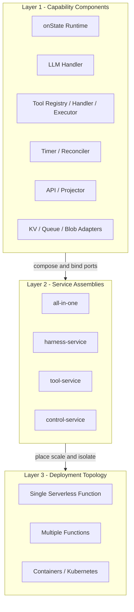

### 14.1 第一层：Capability Component

最小复用和测试单位，表示一项逻辑能力，不关心自己与调用方是否在同一个进程。例如：

- `api`
- `onstate-runtime`
- `harness-definition`
- `execution-profile`
- `handler-registry`
- `effect-dispatcher`
- `llm-handler`
- `tool-handler`
- `tool-registry`
- `tool-executor`
- `memory-handler`
- `timer-reconciler`
- `event-projector`
- `kv-adapter`、`queue-adapter`、`object-store-adapter`

**组件只有一种。** 不存在“单机组件”或“分布式组件”之分——同一个 `llm-handler` 既可以被 `all-in-one` 以函数调用方式加载，也可以作为独立服务被远程消费。差异全部体现在 Assembly 的 Binding 上，而不是组件代码上。

每个组件提供 `component.yaml`，至少声明：

```yaml
id: llm-handler
version: 2.1.0
provides:
  - port: state-handler/v2        # 实现的能力端口
    type: sync                    # sync | async | streaming
requires:
  - port: model-provider/v1
    cardinality: exactly-one      # exactly-one | optional | many
  - port: artifact-store/v1
    cardinality: exactly-one
configSchema: schemas/llm-handler.json
messages:
  consumes: [state.execution.requested]
  produces: [state.execution.completed]
resiliency:
  idempotent: true                # 该组件的重复调用是否安全（面向 §14.2 的 queue Binding 资格）
  timeoutBudget: 120s             # 单次调用最大时长
  cancellable: true
  recoverable: true
lifecycle:
  stateless: true
  health: /healthz
```

组件只能通过显式 Port、Command/Event 或 ArtifactRef 协作，不能直接读取其他组件的内部表或内部对象。组件测试必须包含领域单测、Port 契约测试和消息 schema 兼容性测试；声明 `idempotent: true` 的组件必须附带重复调用测试。

`resiliency.idempotent` 与 `sideEffect`（§5.1）**不是同一个判断**，不可互相推导：前者是**组件实现属性**（同一个 `onState` 被重复调用是否安全），后者是**状态语义声明**（这个状态改变不改变外部世界）。二者恰好都涉及 `idempotent` 一词，但作用域不同——决定 Binding 合法性的是前者（§14.2 规则 2），决定能否内联的是后者（§5.3.2）。

### 14.2 Port 契约与 Binding 语义

Port 是组件间唯一合法的协作通道，以 `name/version` 标识，契约包含接口签名、消息 schema 与语义保证（超时、投递、幂等）。Binding 是 Assembly 对“某个 required port 由谁、以何种方式满足”的决定，有三种类型：

| Binding 类型 | 机制 | 适用场景 | 额外故障语义 |
|---|---|---|---|
| `local` | 进程内函数调用 | all-in-one、MVP、低延迟路径 | 无（调用即成功或抛异常） |
| `queue` | MQ 投递 + Signal 回传 | 长耗时、需独立伸缩、削峰 | 至少一次投递、乱序、消费延迟 |
| `rpc` | 同步 RPC/HTTP Bridge | 低延迟远程调用（如远程 Handler describe） | 超时、重试放大、网络分区 |

三种 Binding 共享同一份 Port 契约，但语义不等价：

1. 组件代码只能面向 Port 契约编程，不得感知 Binding 类型；
2. `queue`/`rpc` Binding 由 **Bridge 组件**（MQ Bridge / RPC Bridge）实现，在 Assembly 装配期生成，业务组件不包含任何 MQ/RPC 代码；
3. 远程 Binding 的超时、至少一次投递、幂等、认证由 Bridge 与运行时统一处理（见 §11）；契约标注 `idempotent: false` 的 Port 禁止绑定 `queue`；
4. 本地 Binding 与远程 Binding 必须通过同一套契约测试，证明语义一致。

### 14.3 第二层：Service Assembly

Service Assembly 决定哪些组件被装配进同一个可运行单元，并完成全部 Port Binding。它是“进程/函数边界”，但尚不包含副本数、区域等部署参数。

单机应用与分布式应用是**同一批组件的两种 Assembly**，而不是两套代码：

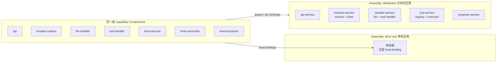

`all-in-one` 示例（单机应用）：

```yaml
id: all-in-one
version: 1.0.0
components: [api, onstate-runtime, harness-definition, handler-registry,
             effect-dispatcher, llm-handler, tool-handler, tool-registry,
             tool-executor, memory-handler, timer-reconciler, event-projector]
bindings:
  state-handler: { type: local }
  state-store: { type: local, component: kv-sqlite }          # 单机权威状态:SQLite(WAL),满足 CAS 与 RPO 0
  chat-event-queue: { type: local, component: ceq-embedded }   # 内嵌实现,含 claim-check KV
  state-event-queue: { type: local, component: seq-embedded }
  object-store: { type: local, component: objectstore-local }
```

> 单机版**默认不承诺 RPO 0**（见 §13.1 分档），但这不意味着可以用默认配置的 Redis 承载 Run 权威状态。理由是它错在两个层面：其一，异步主从复制在故障切换时会**静默丢失已确认写入**——这已不是 RPO 指标问题，而是已提交状态的完整性被破坏，违反 §11.2 不变量；其二，Redis 的条件写与事务语义不足以表达 §6.1 要求的 CAS 与多键原子提交。若确有低延迟诉求，须使用支持同步复制与条件事务的部署形态（如 Redis Enterprise 的 WAIT/CRDT 配置），并在 §13.1 单独标注其实际 RPO。

`distributed` 示例（摘录）：

```yaml
id: distributed
version: 1.0.0
services:
  api-service:
    components: [api]
    bindings:
      state-store: { type: local, component: kv-foundationdb }
      chat-event-queue: { type: local, component: ceq-kafka }
      state-event-queue: { type: local, component: seq-nats }
      object-store: { type: local, component: objectstore-s3 }
  harness-service:
    components: [onstate-runtime, effect-dispatcher, timer-reconciler, handler-registry]
    bindings:
      state-handler: { type: queue, topic: state.execution.requested }
      state-store: { type: local, component: kv-foundationdb }
      chat-event-queue: { type: local, component: ceq-kafka }
      state-event-queue: { type: local, component: seq-nats }
  handler-service:
    components: [llm-handler, tool-handler]
    bindings:
      model-provider: { type: local, component: modelprovider-openai }
      artifact-store: { type: local, component: objectstore-s3 }   # llm-handler 的 requires
      tool-registry: { type: rpc, component: tool-service }        # 跨 Service 的 rpc 绑定
      state-event-queue: { type: local, component: seq-nats }      # 回传 Signal 提示
      state-store: { type: local, component: kv-foundationdb }
  tool-service:
    components: [tool-registry, tool-executor]
    bindings:
      state-handler: { type: queue, topic: state.execution.requested }  # 消费工具执行请求
      artifact-store: { type: local, component: objectstore-s3 }
      secret-provider: { type: local, component: secretprovider-vault }
      state-store: { type: local, component: kv-foundationdb }
      state-event-queue: { type: local, component: seq-nats }
      chat-event-queue: { type: local, component: ceq-kafka }
  projector-service:
    components: [event-projector]
    bindings:
      chat-event-queue: { type: local, component: ceq-kafka }
      state-store: { type: local, component: kv-foundationdb }
      object-store: { type: local, component: objectstore-s3 }
```

注意每个 Service 都显式绑定它实际使用的 Port：`api-service` 需要 `state-store`（写命令与 Outbox）与两条队列；`projector-service` 需要队列与 KV 视图。缺少任一绑定都无法通过 §14.3 的装配校验规则 1。

注意基础设施 Adapter（KV/MQ/对象存储）本身也是组件：在单机 Assembly 里它们以 `local` 方式绑定到内嵌或单机实现，在分布式 Assembly 里绑定到托管服务客户端——**业务组件对此完全无感知**。

**发布前装配校验**（Assembly 不过校验不得发布）：

1. **依赖闭包**：所有 `requires` 都有且恰好有一个满足版本范围的 Binding（`cardinality: many` 除外）。
2. **Binding 合法性**：`queue` Binding 的 Port 必须满足 `idempotent: true`（该值来自提供方组件的 `resiliency.idempotent`，见 §14.1）；`rpc` Binding 的 Port 必须是 `sync` 类型。
3. **无环**：组件依赖图无循环（跨 Service 的 queue 依赖允许成环，但需显式声明）。
4. **消息兼容**：跨 Service 的消息 schema 版本在消费方兼容范围内。
5. **资源约束**：`stateless: false` 的组件只能进入显式声明的有状态 Assembly（本平台默认全部无状态）。
6. **一致性边界**：所有 Service 必须共享同一个 `state-store` 命名空间——任何拆分都不得产生第二个 Run 权威存储。
7. **无隐式依赖**：Service 只能绑定其组件在 `component.yaml` 中显式声明的 `requires`；反向要求——组件声明的每个 `requires` 都必须在本 Service 或某个可达 Service 中有绑定，否则拒绝发布。

官方以两个 DEMO 应用提供参考 Assembly：**standalone**（单机版，`all-in-one`，适合 MVP、私有部署、低负载）与 **cloudnative**（云原生版，`distributed`，适合独立扩缩容、故障隔离、安全隔离）。应用方也可以组合出第三种形态，例如"单机 API + 远程 Handler"的混合 Assembly——这正是组件化的目的：**拓扑是配置，不是代码**。

### 14.4 第三层：Deployment Topology

Deployment Topology 将 Service Assembly 映射到具体运行环境，并声明：

- Serverless Function、Container Task 或 Kubernetes Workload。
- 副本数、并发度、队列触发器、扩缩容与缩容到零策略。
- Region/AZ 放置、网络、IAM、Secret、资源上限和可观测性。
- MQ Topic/Queue、KV Namespace、对象 Bucket 与租户隔离方式。

同一个 `all-in-one` Assembly 可以部署为单个函数或单个容器；同一组 Capability Component 也可以通过 `distributed` Assembly 部署成多个微服务。业务代码和 Harness Definition 不因部署方式改变。

### 14.5 配置的三个作用域

装配配置和 Run 动态配置必须分离：

| 配置 | 作用域 | 示例 | 变更方式 |
|---|---|---|---|
| `ComponentConfig` | 单个能力组件 | Handler 缓冲区、Adapter 参数 | 服务启动或组件重载 |
| `AssemblyConfig` | 一个运行服务 | 本地/远程 Binding、启用的组件 | 重新发布 Service Assembly |
| `ExecutionProfile` | Tenant/Agent/Chat/Run | 模型策略、工具权限、预算、Memory | 版本化动态配置；Run 解析为快照 |

`ComponentConfig` 和 `AssemblyConfig` 决定“系统如何提供能力”；`ExecutionProfile` 决定“一次 Run 如何使用能力”。Secret 只保存引用，在部署或执行时由 Secret Provider 解析。

### 14.6 推荐的演进路径

1. MVP 使用 `all-in-one`，但所有能力从第一天以组件和 Port 组织。
2. 首先拆出高风险或资源特征不同的 `tool-service`。
3. 再按扩缩容需求拆分 `handler-service`、`harness-service` 和 Projector。
4. 只有在吞吐、隔离、团队所有权或合规需求明确时才新增微服务边界。

计算服务全部保持无状态。部署平台只是第三层的选择，不进入领域模型；任何拆分都不能改变 Run 的 KV 一致性边界、MQ 幂等语义和 Event schema。

## 15. 代码仓与模块边界（Go multi-module monorepo）

实现语言为 Go，采用**单仓多 module**：一个 git 仓发布多个独立版本化的 Go module，每个能力组件一个 module。Go module proxy 原生支持该模式——每个子目录有自己的 `go.mod`，以子路径 tag 发布（如 `components/llm-handler/v2.1.0`），消费方按 module 粒度 `go get`，互不影响。

**库而非框架**：ElasticHarness 以 Go module 库的形式分发，**最终应用由应用方组装**——在自己的 module 中 import 所需组件与 adapter、完成 Port Binding、提供自己的 `main`；平台不持有应用的生命周期与进程形态。官方提供两个 DEMO 应用作为组合根范本：

- **standalone-app（单机版）**：全部 `local` binding + 内嵌基础设施（SQLite/本地磁盘/内存队列），单进程单二进制，对应 §14.3 的 `all-in-one` Assembly；
- **cloudnative-app（云原生版）**：`queue/rpc` binding + 托管基础设施（Kafka/Redis/S3），含 K8s/Serverless 部署描述，对应 §14.3 的 `distributed` Assembly。

两个 DEMO 共享同一批组件 module，差异只在组合根的 import 列表与 binding 配置——这本身就是"拓扑是配置，不是代码"的可运行证明。

```text
elastic-harness/                     # 单一代码仓
├── go.work                          # 本地开发 workspace
├── core/                            # module: <repo>/core —— 零基础设施依赖
│   ├── domain/                      # 纯领域模型，不 import 任何外部 SDK
│   ├── ports/                       # 全部能力端口接口（§7 表）
│   ├── effects/                     # Effect、Signal、StateOutcome 类型
│   └── qname/                       # QName 解析与校验（§7.7）
├── components/                      # 每组件一个 module: <repo>/components/<name>
│   ├── onstate-runtime/
│   ├── api/                         # Command/Query/Stream 接入组件
│   ├── harness-definition/
│   ├── execution-profile/
│   ├── handler-registry/            # 中心控制面：注册、能力目录、JWT 签发
│   ├── effect-dispatcher/           # 两相派发：读取 EffectLedger 并调用 Provider
│   ├── llm-handler/                 # 提供 harness/llm.invoke 能力
│   ├── tool-handler/
│   ├── tool-registry/
│   ├── tool-executor/
│   ├── memory-handler/
│   ├── timer-reconciler/
│   └── event-projector/
├── adapters/                        # 基础设施扩展，每适配器一个 module
│   ├── kv-sqlite/                   # 单机权威状态（WAL，满足 CAS 与 RPO 0）
│   ├── kv-foundationdb/
│   ├── kv-redis/                    # 需同步复制配置，见 §14.3
│   ├── ceq-kafka/                   # ChatEventQueue（内嵌 KV claim-check）
│   ├── seq-nats/                    # StateEventQueue
│   ├── objectstore-s3/
│   ├── modelprovider-openai/
│   └── toolexecutor-mcp/
├── apps/                            # 官方 DEMO 应用（组合根范本）
│   ├── standalone-app/              # 单机版：local binding + 内嵌基础设施
│   └── cloudnative-app/             # 云原生版：queue/rpc binding + K8s 部署描述
├── deploy/                          # 第三层：部署拓扑描述
└── schemas/                         # component.yaml、assembly、事件与 Port schema
```

依赖与发布规则：

1. **单向依赖**：`components/*` 与 `adapters/*` 只依赖 `core` 及更底层组件；`core` 不 import 任何 adapter、云 SDK、Web 框架或数据库客户端；`adapters/*` 实现 `core/ports` 中定义的接口。
2. **基础设施以扩展方式引入**：adapter module 通过工厂注册（构造时把实现注册进 Port Registry）暴露能力；**只有组合根（demo 或应用方自己的 `main`）允许 import adapter**——组合根选择了哪些 adapter，二进制就编译进哪些，未选中的依赖不进入产物。Go 不使用动态 `.so` plugin（版本对齐与兼容性问题），扩展点在编译期由组合根决定。
3. **独立版本**：每个 module 独立语义版本、独立 CI 测试、独立 tag 发布；跨 module 依赖固定到已发布版本，本地联调由 `go.work` 的 `replace` 接管。
4. **契约先行**：组件间只通过 `core/ports` 接口与 `schemas/` 中的消息 schema 协作；升级某个组件不需要全仓同步升级，兼容性由 Port 契约测试兜住（§14.1）。
5. **Assembly 即 import 图**：单机版与云原生版的差异只体现在组合根的 import 列表与 binding 配置上（§14.3），业务组件代码零改动。

## 16. 分阶段落地

### Phase 1：最小可恢复闭环

**范围已确认**：Phase 1 按本期文档全量实施——包含 Handler Registry 与短期 JWT/心跳刷新、双队列、对象存储、SSE、取消与重试、故障注入，而非只做"能跑通一次对话"的极简切片。这是一个**有意识的取舍**：Registry + 调度式解析与两相派发是本架构的核心主张，若推迟到 Phase 2，Harness Definition 的格式、`requires` 的语义与 Snapshot 的 `resolvedBindings` 都将在缺少真实压力的情况下定型，返工成本高于一次做完。代价是 Phase 1 周期显著拉长，且 JWT TTL / 心跳周期 / 重试预算这些参数只能在无真实负载时给出初值，需要留到 Phase 2 用生产数据校准（见 §13.1）。

- Chat/Message/Run 基础模型。
- Harness Definition IR（逻辑 capability 声明）、校验器、版本仓库与绑定解析器。
- Handler Registry（注册、能力目录、心跳与短期 JWT 凭证）与通用 `onState` 内核。
- LLM/Tool 两类 State Handler 与 Effect Dispatcher（对外副作用走两相派发；模型调用按 §5.3.2 内联直调）。
- 单模型 Provider Adapter、Tool Registry、显式 Manifest 注册与单协议 Tool Executor。
- Run Snapshot、CAS、租约、Outbox、MQ 唤醒。
- 持久 Timer、Effect Ledger、SSE 事件流、对象产物、取消与基础重试。
- standalone DEMO 应用（单机版组合根范本）。
- 端到端故障注入：重复消息、Worker 中断、丢失回调、完成/超时竞争和恢复。

### Phase 2：生产可用

- 多租户 IAM、配额、预算、审计和密钥管理。
- MCP/A2A/RAG、协议自动发现、工具健康检查、异步工具回调与人工审批。
- 远程 Handler 协议、Handler 独立扩缩容与隔离。
- 长期 Memory、投影重建、可重试失败与 `BLOCKED` Run 的运维工具。
- cloudnative DEMO 应用（云原生组合根范本）与 K8s/Serverless 部署拓扑。
- Provider 限流、熔断、降级和多地域备份。

### Phase 3：生态与规模化

- 插件 manifest/SDK、兼容性认证和租户级路由。
- 状态机可视化、版本迁移、Run fork/replay。
- 多模型策略、语义缓存、批处理和成本优化。
- 跨区域主动-主动与合规策略包。

## 17. 必须优先验证的架构风险

1. **状态机粒度**：单步过大会受到函数时限影响，过小会放大 MQ/KV 成本；需用真实工作负载压测。
2. **流式响应持久化成本**：不能为每个 Token 做一次 KV 事务；应批量形成 chunk event，并以最终消息收敛。
3. **非幂等工具**：支付、发信、创建工单等副作用需要业务级去重或显式人工确认。
4. **上下文膨胀**：历史、工具结果和 Memory 必须经过预算化选择与摘要，不能每轮完整加载。
5. **MQ 与权威事件的边界**：必须通过契约测试证明消息丢失、重复和乱序不会破坏 Run 不变量。
6. **状态机版本迁移**：上线前需要至少验证旧 Snapshot 在新代码下的继续执行或显式迁移路径。
7. **外部工具可信度**：注册发现得到的名称、描述和 schema 都是不可信输入；必须验证、限权且不能直接成为高优先级指令。
8. **恢复路径自身的正确性**：Reconciler 与 `recover` 是最后防线，必须有确定性模拟测试与故障注入覆盖，否则会成为"理论上可恢复"的盲区。
9. **竞态裁决覆盖不全**：审批/超时、取消/成功、心跳恢复/失联等所有"竞态完成"组合都必须落在 §10.3 的 CAS 裁决模型内；遗漏一类即可能产生双结果。
10. **自续跑风暴**：`entered` 自续跑让"无外部事实的连续迁移"变成一连串唤醒。若定义中存在可自动循环的路径（如 `llm → tools → llm` 的连续推进），必须由**步骤预算与 `runDeadline` 强制收敛**，否则会退化为高频自旋烧钱。这是 §5.3.1 合并语义之外新增的风险面，Phase 1 必须用真实负载验证单 Run 的最大自续跑深度。

## 18. 架构决策摘要

| 决策 | 选择 | 原因 |
|---|---|---|
| 核心执行模型 | 持久化状态机 | 支持缩容到零、暂停恢复与审计 |
| Harness 定义 | 版本化声明式 IR + 逻辑 capability 需求 | 定义与环境解耦，支持编排、校验与可重现执行 |
| 统一运行入口 | `StateHandler.onState` | 内核与具体 LLM/Tool/RAG 消费逻辑解耦 |
| Handler 绑定 | 中心注册 + 调度式解析 + Run 时固定 | 定义不指定实现，拓扑灵活且运行可重现（K8s 风格） |
| Handler 凭证 | 短期 JWT（1h）+ 心跳滚动刷新 | 未授权 MQ 写入的爆炸半径被封顶 |
| 一致性边界 | Run 聚合 + CAS | 避免分布式锁成为唯一正确性来源 |
| 消息语义 | 至少一次 + 幂等效果 | 符合主流 MQ 与 Serverless 现实 |
| 事件发布 | Transactional Outbox | 避免状态提交与消息发布双写不一致 |
| Effect 派发 | 两相：意图先落账，再派发 | 保证未提交的迁移不产生对外副作用 |
| 模型调用路径 | `sideEffect: pure` + 内联直调（不经 Effect Ledger） | 调模型不改变外部世界，无需两相；成本由预算闸单独把关，避免把"贵"误声明为"危险" |
| 内联快路径 | 仅 `sideEffect: pure`，无例外 | 不改变世界的调用才有资格提前执行；`idempotent` 需靠不可验证的去重声明，故不开此口 |
| 事件通道 | 双队列：ChatEventQueue + StateEventQueue | 领域事件与内部唤醒在 SLA、保留期与大小特征上分离 |
| 大事件 | ChatEventQueue 内嵌 KV claim-check | 底层 MQ 的消息大小限制不泄漏到领域层 |
| 会话上下文 | ChatContextTree（不可变单父树 + 分支） | 编辑/重生成不改写历史，天然支持 fork 与回看 |
| 大对象 | 逻辑 Artifact + 不可变引用 | 控制 KV/MQ 成本；物理存储随 Assembly 替换 |
| 工具模型 | 统一异步 Invocation | 同时覆盖 TOOL、MCP、A2A、RAG 与人工审批 |
| 插件分层 | Handler Plugin + Provider Adapter | 分别替换状态语义和底层供应商实现 |
| 外部工具 | Registry + immutable Revision + Invocation | 支持动态注册、协议适配和可审计执行 |
| 可插拔性 | Hexagonal Ports/Adapters | 隔离厂商 SDK 和基础设施差异 |
| 长任务 | 等待态释放计算 | Harness Worker 保持无状态并降低成本 |
| 交付形态 | v1 为可自托管框架（Go module 库 + 应用方组合根） | 信任域限于单部署，运维责任清晰；模型与接口保留平台化空间 |
| Handler Registry 边界 | 部署内中心控制面 | 与 K8s 同构的调度式解析，无需全局注册即可成立 |
| SLO 分档 | 按 Assembly 分档（见 §13.1） | 单机版结构上无法承诺 RPO 0，统一数字会逼迫它背负做不到的承诺 |
| Timer 陈旧判据 | `stateEnterCounter` 而非 `stateVersion` | 同一状态内的迁移也推进 `stateVersion`，用它判断会误杀有效 Timer |
| Registry 可用性 | 无状态多副本 + 共享 KV + JWKS 离线验签 | Registry 非运行时热路径:故障只阻断注册/解析/吊销增量,不阻断在途 Run 与 MQ 写入 |
| 流推送扩展 | 无状态 Stream Gateway + EventIndex 断线补齐 | 任意副本数水平扩展,有序性来自 sequence 而非连接粘性 |
| Device 身份 | Enrollment(预置 token/mTLS) + `kind: device` 短期凭证 + sessionEpoch 绑定校验 | 离线 Agent 的伪造回传在鉴权层被拒,旧会话回传按 late event 处理 |
| 队列分区 | 有限常量分区 + 路由键哈希 | 分区数随吞吐规划,不随 Run 数无界增长;权威有序性由 EventIndex 保证 |

该架构的最小核心不是“调用一次模型”，而是：**可靠接受一个事实，确定性推进一次状态，幂等地产生副作用，持久化检查点，再由事件驱动下一次推进。**

## 19. 术语表

| 术语 | 定义 |
|---|---|
| Harness Definition | 版本化的 Harness（状态机）声明式定义（IR）；只声明逻辑需求，Run 创建时固定版本 |
| Capability Requirement（requires） | 状态节点对消费能力的逻辑声明：capability、版本范围、特性与约束，不含具体 Handler |
| ResolvedBinding | Run 创建时调度式解析的结果（state → handlerId + version + deployment），随 Snapshot 固定 |
| Handler Registry | 中心控制面：Handler 注册、能力目录、心跳与 JWT 凭证签发 |
| Handler 凭证 | 注册后签发的短期 JWT（TTL 1h）；MQ 写入强制携带，心跳滚动刷新 |
| ChatContextTree | Chat 的 Git 式上下文树：不可变单父节点 + 分支指针；编辑与重生成即开新分支 |
| ChatEventQueue | 领域事件的权威分发通道；内嵌 KV claim-check，屏蔽底层 MQ 的消息大小限制 |
| StateEventQueue | Harness 内部状态事件中转（唤醒提示）；可丢弃，Inbox 才是真相 |
| Artifact | 逻辑大对象资源（上传文件与生成产物的统一抽象）；`ArtifactRef` 不含物理位置 |
| State / Node | 状态机节点：声明 `requires`（逻辑能力需求）与迁移规则，**不绑定具体 Handler** |
| Signal | 唤醒 Run 的一次事实通知（用户输入、工具回调、定时器、审批、取消） |
| Inbox | Run 维度持久化的待处理 Signal 队列，是唤醒语义的权威来源 |
| StateOutcome | Handler 返回的结构化结果；内核据此匹配 Transition，Handler 不直接决定下一状态 |
| Effect | Handler 请求的副作用意图（调用模型/工具、写产物、排定时器等）；**`pure` 状态的直调不算 Effect**，因其不改变外部世界 |
| Effect Ledger | Effect 意图与结果的持久账本；保证已提交意图必然被派发且至多一次生效 |
| Invocation | 一次具体的工具/外部执行，固定 `toolId + registrationRevision + executorVersion` |
| Attempt | 对同一 Step / Invocation 的一次执行尝试；重试产生新 Attempt |
| Step | 一次完整状态迁移（读取 Snapshot → onState → CAS 提交） |
| Run Snapshot | Run 的权威控制状态（当前状态、版本、预算、绑定、检查点引用）；**不含待处理列表**，只保留计数与水位 |
| stateVersion | Run 快照的单调版本号，所有迁移的 CAS 条件 |
| Lease / Fencing Token | Worker 的短期执行租约与单调令牌；阻止过期 Worker 写入 |
| Outbox | 与状态同事务提交的待发布事件表，由 Relay 异步投递到 MQ |
| Late Event | 裁决完成后到达的迟到事件；只记录审计，不改变事实 |
| Reconciler | 周期扫描未完成意图并重新唤醒的修复组件；只做唤醒与标记，不改业务状态 |
| ExecutionProfile | 一次 Run 使用的能力与策略配置；Run 启动时解析为不可变快照 |
| Device / Workspace | 工具的实际执行载体 / 可操作的资源作用域 |
| Handler / Provider | 状态语义插件 / 底层能力适配器；两层独立替换 |
| Agent | 具名执行人格：默认 Profile + 默认 Harness Definition + 系统指令；配置容器，不持有 Run 状态 |
| sideEffect | 状态对**外部世界**的变更等级（pure / idempotent / non-idempotent）；只判"重复/超前会不会让世界变错"，不判成本 |
| 内联快路径 | `pure` 状态的直接调用：不经 Effect Ledger、不增一次迁移；成本由预算闸把关 |
| 计费口径 | 只认已提交的 Step 记录；并发竞争的重复执行成本由平台承担，不计入 Run 预算与租户账单 |
| onFailure | Handler 失效处置：fail / rebind / degrade；跨实现转移必须为新 Attempt |
| Effect Dispatcher | 读取已提交的 `PENDING` 意图并调用 Provider 的派发组件（两相派发的第二相） |
| Checkpoint | Run Context 的低成本续跑锚点；非权威，可从事件流重建，存于对象存储 |
| 自续跑（entered） | 无外部事实的内部推进：内核在同一事务内向 Inbox 写入 `entered` Signal 再唤醒自己；不允许绕过 Inbox |
| stateEnterCounter | 进入新状态时递增的计数器；判断 Timer / 迟到 Signal 是否属于当前状态实例 |
| Platform Principal | 非 Handler 的平台组件（Relay、Timer、API）的 MQ 写入身份；与 Handler 同一 JWT 路径，claims 标注 `kind: platform` |
| JWKS | Registry 公布的签名公钥集合（按 `kid` 索引）；MQ Gateway 与 API 离线验签,不依赖 Registry 存活 |
| Enrollment | Device 首次注册的身份核验流程：预置 enrollment token 或 mTLS 证书;管理操作,默认不开放 |
| ledgerVersion | Effect Ledger 的条目版本；`effectId + ledgerVersion` CAS 是派发权的唯一裁决点 |
